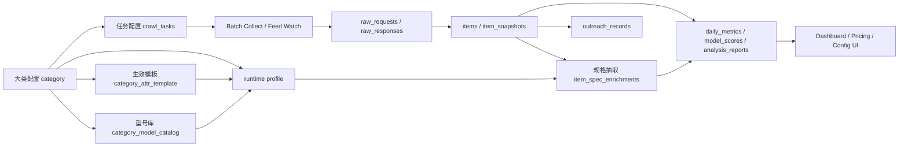
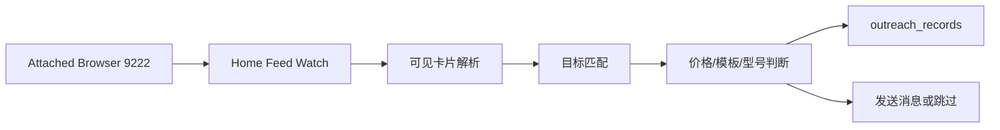
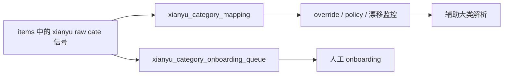
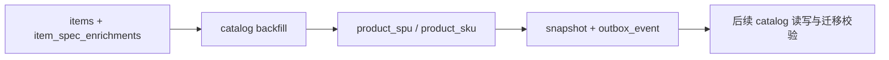

# Goofish Insight 系统技术说明书

Status: Working Baseline v2
Updated: 2026-04-24
Workspace: `<repo-root>`

## 1. 文档定位

这份文档是当前仓库的系统级技术说明书。

它的作用不是写一份抽象愿景，而是明确回答 5 个问题：

1. 这套系统现在到底在做什么
2. 核心业务链路是否清晰
3. 当前架构是否合理，问题在哪里
4. 后续改造应该围绕什么主轴推进
5. 未来新增能力时，哪些边界不能再被打破

这份文档优先描述真实现状，再给出目标收口方向。

如果后续发生系统级结构变更，应该优先更新本文件，再推进代码与运维改造。

配套实施文档：

- [docs/23-best-practice-architecture-implementation-spec.md](<repo-root>/docs/23-best-practice-architecture-implementation-spec.md)
  面向“系统最佳实践收口”的目标架构、数据合同、作业合同与运行时合同
- [docs/16-buy-side-implementation-spec.md](<repo-root>/docs/16-buy-side-implementation-spec.md)
  面向“二手买入决策助手”目标的详细技术实施步骤

## 2. 系统定义

Goofish Insight 是一套面向闲鱼公开供给的二手买入决策系统。

系统的核心目标不是还原真实成交全貌，也不是做泛化采集平台，而是围绕稳定大类持续采集公开列表样本，完成型号与配置识别，建立合理价与买入机会判断，并把结果沉淀为可执行的买方工作台。

当前建议使用一句话定义系统：

`围绕稳定大类，持续采集闲鱼公开供给，结构化识别型号与配置，计算合理价、风险与买入机会，并驱动买方决策工作台。`

## 3. 核心业务目标

### 3.1 当前主目标

- 识别值得长期监控的二手市场大类
- 对大类下的型号、配置、价格带形成结构化画像
- 生成配置级 `fair_price` 与 `buy_ceiling`
- 识别值得立即关注的 `buy_opportunity`
- 为每条机会输出折价、风险与进入原因
- 在首页 feed 和批量搜索里发现可行动目标
- 让操作者完成关注、联系、购买与反馈，并把反馈回流到校准链路

### 3.2 当前重点大类

- `apple_computer`
- `garmin_watch`

已开始扩展的方向：

- `camera_body`
- `camera_interchangeable_lens`
- `mobile_market_history`

### 3.3 非目标

- 不做平台真实成交口径
- 不做全站级高并发无人值守采集
- 不采集聊天、手机号、地址、实名等敏感信息
- 当前阶段不拆微服务
- 当前阶段不以远端无头浏览器为唯一路径

## 4. 设计原则

- 只采集公开可见数据，保留证据，避免隐私数据
- 浏览器驱动优先，监听真实网络响应，不依赖脆弱的页面文本抓取
- 大类驱动优先，平台原始类目信号只做辅助治理
- 规则优先，LLM 作为补强与审查能力，而不是主配置来源
- 保留原始响应与结构化结果之间的回溯关系
- 当前以模块化单体为目标，而不是过早拆服务
- 对经常反复发生的运维动作，优先沉淀为脚本、SOP、健康检查和运行契约

## 5. 系统边界

### 5.1 纳入系统的能力

- 任务配置
- 闲鱼搜索采集
- 首页 feed 监控
- 原始请求与响应存储
- 商品标准化
- 规格抽取
- LLM 二次审查与写回
- 合理价、买入上限与机会识别
- 买方工作台与反馈闭环
- 型号库维护
- 大类、模板、属性配置
- catalog 迁移与回填
- 本地 runtime 控制
- Android overlay 采集辅助

### 5.2 不纳入当前系统主干的能力

- 实时消息队列基础设施
- 多租户商家系统
- 公网开放数据库
- 搜索索引大规模写入与检索集群
- 完整交易工作台

## 6. 外部依赖

系统当前依赖以下外部能力：

- 闲鱼公开 Web 页面与列表接口
- 本地真实浏览器会话与登录态
- PostgreSQL
- 本地或兼容 OpenAI 的 LLM 接口
- macOS `launchd` 常驻任务
- Android 端屏幕采集能力

关键现实约束：

- 闲鱼采集稳定性依赖真实浏览器环境
- 本地大模型、浏览器和 dashboard 已经成为实际运行面的组成部分
- 远端 Linux 服务器当前主要承担数据库与后续 Web 部署角色

## 7. 当前系统拆解

### 7.1 仓库层级

- `apps/collector`
  当前系统的操作核心，承载采集、标准化、Web、配置接口、review、runtime 控制
- `apps/dashboard-react`
  React 主工作台，唯一主运营前端
- `apps/dashboard-nest`
  BFF 回退层 + 静态托管
- `apps/web`
  Jinja 模板与静态资源（legacy）
- `apps/analyzer`
  分析边界模块，承载买方决策聚合、评分、报告和读模型
- `apps/android-overlay`
  Android overlay 采集辅助端
- `scripts`
  本地运行、worker、模型、OpenViking、批处理脚本
- `infra`
  PostgreSQL 初始化、launchd plist、部署相关文件
- `docs`
  项目级文档、SOP 与方案说明

### 7.2 代码分层

当前 Python 包已经开始朝以下层次演进：

- `entrypoints`
  CLI 与 FastAPI 路由入口
- `application/services`
  用例编排、查询、配置写入、运行时控制
- `domain`
  纯业务规则与契约
- `presentation`
  模板过滤器与展示层格式化

这是正确方向，但目前仍处于过渡期。

### 7.3 实际运行单元

当前真实运行单元包括：

- Dashboard Web
- Batch Collect
- Home Feed Watch
- Attached Browser resident
- Review V3 resident worker
- Local Qwen model on `127.0.0.1:8000`
- Qwen2.5 VL runtime on `127.0.0.1:8020`
- Android overlay analysis path

这些运行单元已通过 `launchd`、shell 脚本和 Web runtime control page 组合管理。

## 8. 核心业务链路

### 8.1 主链路：大类驱动采集与分析

主链路的业务含义：

1. 任务不再直接围绕模糊业务域配置，而应先绑定大类
2. 大类决定当前生效模板、prompt profile、型号库和任务范围
3. 采集结果进入 `items` 与 `item_snapshots`
4. 规格抽取将商品解析成更稳定的型号与配置结构
5. 看板、选品分析和消息动作都消费这条结构化主链路

### 8.2 运营链路：首页 feed 消息模式

这条链路体现的是“运营动作”，不是纯采集动作。

### 8.3 治理链路：raw cate 辅助治理

这里的关键原则是：

`raw cate 不是主配置入口，而是平台观测与治理信号。`

### 8.4 catalog 迁移链路

这条链路代表系统正在从“旧商品宽表”逐步迁往“元数据驱动商品模型”。

## 9. 数据架构

### 9.1 配置主数据层

这层是未来系统的主配置基座。

- `category`
  大类树与业务主分类
- `category_runtime_profile`
  大类级 runtime 配置，如 `prompt_profile`、当前生效模板
- `attribute_definition`
  属性定义中心
- `attribute_option`
  枚举属性可选值
- `category_attr_template`
  大类模板头，支持版本
- `category_attr_template_item`
  模板下具体属性编排
- `category_model_catalog`
  大类下标准型号库
- `category_model_alias`
  型号别名
- `crawl_tasks`
  生产采集任务
- `crawl_task_query`
  查询词
- `crawl_task_lexicon`
  词表

### 9.2 采集事实层

- `browser_sessions`
  浏览器登录态与 profile 状态
- `crawl_runs`
  每轮执行记录
- `raw_requests`
  原始请求证据
- `raw_responses`
  原始响应证据
- `items`
  当前商品主视图
- `item_snapshots`
  商品时间快照
- `seller_profiles`
  卖家画像

### 9.3 结构化增强层

- `item_spec_enrichments`
  商品规格抽取结果
- `xianyu_category_mapping`
  原始类目信号映射与 override
- `xianyu_category_onboarding_queue`
  原始类目 onboarding 队列

### 9.4 分析与运营层

- `daily_metrics`
  日级指标
- `model_scores`
  型号级分数
- `analysis_reports`
  报告与专题结果
- `outreach_records`
  外联消息记录

### 9.5 catalog 目标域模型

- `product_spu`
- `product_sku`
- `product_spu_attr_value`
- `product_sku_attr_value`
- `outbox_event`
- `product_attr_audit_log`

### 9.6 当前数据架构的真实状态

当前数据库同时存在两套商品表达：

1. 旧主链路：
   `items + item_spec_enrichments + model_scores`
2. 新主链路：
   `category/template/model catalog + product_spu/product_sku`

这不是错误，而是迁移中的过渡状态。

但它会带来三个后果：

- 概念重复
- 写入路径重复
- 团队心智成本升高

所以后续必须明确“谁是长期真相源”。

当前建议结论：

`category/template/model catalog` 作为长期配置真相源  
`product_spu/product_sku` 作为长期商品结构真相源  
`items/item_spec_enrichments` 作为采集事实层和迁移兼容层逐步收口

## 10. 当前部署与运行架构

### 10.1 设计上的部署目标

仓库文档中的原始部署目标是：

- 远端 Linux 服务器
- Docker Compose
- PostgreSQL
- Web 对外展示

### 10.2 当前实际运行方式

当前真实运行方式已经演化成：

- 本地 macOS 负责浏览器、采集、模型、dashboard、worker
- 远端 PostgreSQL 作为主要数据平面
- 本地 `launchd` 负责 resident runtime
- Web 控制页负责部分本地进程控制

也就是：

`本地执行平面 + 远端数据平面`

### 10.3 推荐的正式口径

后续文档和实现应明确承认这件事：

- 浏览器采集与本地模型属于执行平面
- PostgreSQL 与未来只读 Web 展示属于数据和消费平面
- 不要再把“远端 Docker Compose”误写成当前唯一运行方式

### 10.4 当前运行风险

- 启停语义不统一
- `launchd` 与脚本行为容易出现契约不一致
- 本地 dashboard 同时承担业务 UI 和运维控制台
- worker、浏览器、模型和看板都耦合在一个仓库运行面内

## 11. 架构评估

### 11.1 当前架构合理的地方

- 选择模块化单体是对的
- 数据证据链完整，原始响应到结构化结果可回溯
- 大类驱动、模板驱动、型号库驱动的方向是对的
- 内部运营台采用 FastAPI + Jinja + 静态 JS 是合理的
- 测试覆盖面不差，说明很多规则已经开始被固化

### 11.2 当前架构的核心缺陷

#### 缺陷 1：`collector` 过载

`apps/collector` 已经同时承担：

- 采集执行
- 标准化
- spec enrichment
- review
- dashboard
- config 后台
- runtime control
- catalog backfill
- mobile / overlay 扩展

这会让任何单点变更都影响多个业务面。

#### 缺陷 2：旧世界与新世界并存但未收口

系统同时有：

- `business_domain` 驱动思维
- `category/template/model catalog` 驱动思维

这会导致术语、配置入口和读写路径分裂。

#### 缺陷 3：分析层边界仍在过渡

`apps/analyzer` 已承接买方决策链路，但部分分析逻辑仍留在 `collector`，导致：

- 评分、报告、聚合与采集实现仍有耦合
- 分析作业体系尚未完全独立

#### 缺陷 4：运行架构没有正式建模

系统真实存在一个 runtime plane，但它主要分散在：

- shell 脚本
- `launchd` plist
- runtime control service
- SOP 文档

缺少统一的运行契约。

#### 缺陷 5：仍有超级模块

当前仍有若干高复杂度文件，例如：

- `cli.py`
- `specs.py`
- `pricing.py`
- `runtime_controls.py`
- `xianyu_category_mapping.py`

这说明分层方向正确，但收口还没完成。

#### 缺陷 6：`.py` 级别的 ownership 还没有真正隔离

当前很多 Python 文件仍然按“能跑”而不是按“边界”来分工，结果是：

- service、script、entrypoint、adapter 的职责容易互相渗透
- 脚本文件承载了过多业务判断，导致复用和测试都不稳定
- 新能力经常先落到现有大文件里，再慢慢变成新的 god module

更稳妥的改进方向不是继续加文件，而是先把每个 `.py` 文件的主责钉死：

- service 文件只保留可测试、可复用的业务编排
- script 文件只保留参数解析、环境装配和一次性执行入口
- entrypoint 文件只做命令注册和转发
- adapter 文件只做外部系统对接

为了避免“名义拆分、实际混写”，后续所有 Python 改造都应先回答一个问题：这个文件的唯一主责是什么。

建议把 `.py` 文件的默认 owner boundary 固定为以下四类之一：

- `entrypoint`
  只负责命令注册、参数转发、路由挂载
- `service`
  只负责可测试、可复用的业务编排
- `script`
  只负责一次性执行入口、环境装配、参数解析
- `adapter`
  只负责外部系统、协议或平台对接

如果一个文件暂时承载过渡逻辑，也只能挂靠到其中一个默认 owner boundary，不能同时被两个边界共同认领。
过渡模块可以存在，但只能作为临时兼容层，不能继续吸纳新职责。

建议的最低约束是：

- 每个 `.py` 文件只能有一个默认 owner boundary
- 文件说明、模块命名和实现内容必须一致，不能用名字伪装边界
- 过渡模块只能暂存兼容逻辑，不能继续吸纳新职责
- 任何新增复杂能力，先落到 `application / domain / entrypoints / infra-ish adapter` 中的稳定边界，再决定是否保留 facade
- 如果一个文件需要同时承担两类以上职责，优先拆出新文件，而不是继续叠加分支

对于当前仓库，较合理的 maturity 判断不是“拆了多少文件”，而是“多少 `.py` 文件已经具备单一、可测试、可解释的主责”。

这是一条更保守的演进路径，优先减少所有权重叠，而不是追求名义上的“拆分数量”。

### 11.3 总体判断

当前系统不是“方向错误”，而是“主干正确、扩张过快、边界滞后”。

因此后续不应该推倒重来，而应该：

- 明确主轴
- 收拢概念
- 拆出运行平面
- 让分析层独立
- 继续拆超级模块

## 12. 正式主架构结论

后续所有改造默认服从以下结论：

### 12.1 业务主键

长期业务主键优先是 `category`，不再是 `business_domain`。

`business_domain` 保留为兼容字段和历史读写辅助字段，但不再作为新能力的长期主配置入口。

### 12.2 主配置链路

长期主配置链路是：

`任务 -> 大类 -> 生效模板 -> runtime profile -> 型号库`

### 12.3 主商品结构链路

长期主商品结构链路是：

`采集事实 -> 标准化商品 -> catalog SPU/SKU`

### 12.4 主运行架构

长期应采用：

`模块化单体 + 明确运行单元 + 本地执行平面 / 远端数据平面`

而不是：

- 继续把所有能力都塞进一个不分层的 collector
- 继续把脚本和页面控制逻辑混在一起
- 继续把实验性扩展当成主干功能推进

## 13. 后续演进规划

### Phase A：系统主轴冻结

目标：

- 冻结术语和主链路
- 统一文档口径
- 明确谁是长期真相源

完成标准：

- 所有新增功能文档不再以 `business_domain` 作为长期主键表述
- 所有配置页都围绕 `category/template/model/task` 说明

### Phase B：采集与配置收口

目标：

- 把任务、大类、模板、型号库真正收成一条生产主链
- 降低 raw cate 和脚本配置的主导地位

完成标准：

- 生产采集从配置页和数据库任务驱动
- `monitor_tasks.json` 不再是运行时唯一来源

### Phase C：分析层独立

目标：

- 将聚合、评分、报表、专题生成真正迁入 `apps/analyzer`

完成标准：

- 分析作业不再主要以 ad hoc CLI 和 shell 片段存在
- `daily_metrics / model_scores / analysis_reports` 有明确生成入口

### Phase D：运行平面产品化

目标：

- 统一 resident runtime 的启动、停止、状态与健康检查契约

完成标准：

- Dashboard 控制页、脚本、SOP 的启停语义一致
- resident runtime 不再依赖模糊的进程假设

### Phase E：catalog 切流

目标：

- 让 catalog 模型成为长期商品域真相源

完成标准：

- 新类目不再依赖旧宽表思路扩展
- `product_spu/product_sku` 成为主读写模型

## 14. 本阶段必须遵守的架构约束

从本文件生效开始，新增改造默认遵守以下约束：

1. 不新增绕开 `category/template/model catalog/task` 的平行配置体系
2. 不把 `raw cate -> 大类` 重新提升回主配置入口
3. 不把新的分析作业继续主要堆进 `collector`
4. 不把新的 resident runtime 逻辑只写成脚本而没有契约说明
5. 不在没有迁移策略的前提下继续扩大旧商品表达与新 catalog 表达的双轨差异
6. 不新增新的 god module，新增复杂能力优先按 `entrypoints / application / domain / presentation / infra-ish adapter` 收口
7. 不让 `.py` 文件同时承担脚本入口、服务编排、外部适配和临时修补逻辑

### 14.1 Python 文件 ownership 收口

针对 `Python service or scripts` 这条工作流，当前最高优先级不是继续加文件，而是先把现有 `.py` 文件的主责固定下来。
这一轮收口必须服从“证据优先于文档愿景”的原则：文件边界以真实入口、真实运行、真实测试结果为准，不能只按命名、注释或任务包描述来认领。

执行口径如下：

- 每个 `.py` 文件只能有一个默认 owner boundary
- 默认 owner boundary 只保留四类：
  - `entrypoint`
  - `service`
  - `script`
  - `adapter`
- 过渡模块可以存在，但只能暂存兼容逻辑，不能继续吸纳新职责
- 如果一个文件必须承担两类以上职责，优先拆出新文件，而不是继续叠加分支
- 文件说明、模块命名和实现内容必须一致，不能用名字伪装边界
- 所有 ownership 判断都应回到当前仓库的可运行事实：CLI 入口、服务入口、测试覆盖、调度脚本和导入关系，而不是抽象目标图
- 任何新增或调整的 `.py` 主责，都应先证明它能支撑一个可验证的小样本闭环，再考虑扩大范围

这条收口规则的目标不是减少文件数量，而是让每个 `.py` 文件都具备单一、可测试、可解释的主责。

## 15. 风险清单

- 平台响应载荷、字段和页面流程漂移
- 本地浏览器登录态失效
- 本地大模型端口和服务身份漂移
- resident runtime 启停不一致
- 大类定义过粗或过细导致分析无效
- catalog 双轨迁移时间过长导致系统长期背负两套模型
- Android overlay 与主采集链路混淆，稀释核心产品焦点

## 16. 当前结论

当前系统可以继续演进，不需要推倒重来。

但后续所有“全部改掉”的前提应该是：

- 不是把已有业务能力打碎重做
- 而是基于当前真实能力，把主轴收成一套清晰的系统

这份文档就是该主轴的第一版基线。
