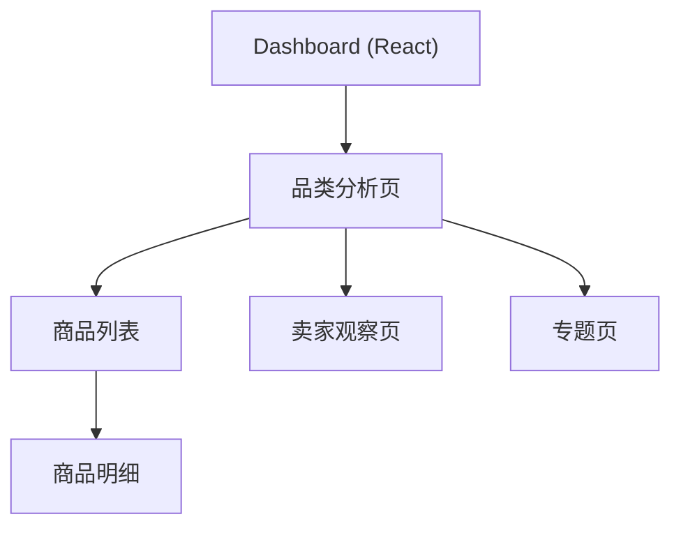

# 前端分析结果呈现路径

## 1. 前端目标

前端不是简单展示一堆图，而是要让人能快速回答四个问题：

- 这个品类现在长什么样。
- 哪些价格带和品牌最值得关注。
- 哪些商品和卖家异常。
- 最近一段时间发生了什么变化。

对于这个项目，还要额外回答三个业务问题：

- 这条商品是否值得立即关注。
- 合理价和买入上限是多少。
- 风险在哪里、下一步该做什么。

## 2. 当前前端架构

### 2.1 主工作台：React Dashboard

**`apps/dashboard-react`** 是当前主运营工作台，不是 Vite 脚手架示例。

主要页面：

- `/` — 看板首页、品类筛选、最新商品列表
- `/buy/opportunities` — 买方机会工作台
- `/runtime` — 常驻任务运行控制
- `/llm-devops` — LLM DevOps 页面
- `/llm-ops` — LLM trace 与 token 使用观测
- `/agent-harness` — 多 Agent pilot 观测台

技术栈：

- React + TypeScript
- React Router
- TanStack Query
- CSS Modules 或 Tailwind

### 2.2 BFF 层：Nest Dashboard

**`apps/dashboard-nest`** 承担：

- 托管 `apps/dashboard-react` 构建产物
- 代理 FastAPI 的 dashboard / progress 接口（避免跨域与部署耦合）
- 静态资源托管与 BFF 回退

### 2.3 旧模板层：Web

**`apps/web`** 是 Jinja2 模板与静态资产层，已标记为 legacy，仅保留旧页面回退跳转。

## 3. 页面结构

### 3.1 首页 Dashboard

- 展示整体采集状态
- 展示品类总览卡片
- 展示核心指标变化
- 展示异常提醒

### 3.2 品类分析页

- 价格分布
- 品牌/型号分布
- 地区分布
- 上新趋势
- 高频关键词
- 价格基线覆盖情况
- 可行动机会摘要

### 3.3 商品明细页

- 商品基础信息
- 标题与标签
- 价格和参考区间
- 图片缩略图
- 卖家基础信息
- 原始响应快照入口

### 3.4 卖家观察页

- 卖家发品数量
- 卖家覆盖品类
- 价格区间
- 疑似重复发品情况

### 3.5 专题页

- 异常价格专题
- 热门型号专题
- 时间趋势专题
- Garmin 买入机会专题
- Apple M 芯片电脑买入机会专题

## 4. 前端交互路径

1. 用户先在 Dashboard 选择目标品类。
2. 进入品类页看价格带、品牌占比和趋势。
3. 点击异常区段或品牌卡片进入商品列表。
4. 在商品明细页查看单个商品的上下文和原始信息。
5. 回到专题页做横向比较。

## 5. 信息架构

## 6. 视觉方向

- 避免做成普通后台表格堆叠。
- 视觉基调建议偏“买方决策工作台”而不是“市场情报板”。
- 首页强调卡片密度、颜色区分和趋势信号。
- 列表页强调筛选效率、风险提示和动作效率。
- 明细页强调上下文、价格证据链和反馈动作。

## 7. 第一版组件清单

- 指标卡片
- 趋势折线图
- 价格分布直方图
- 品牌占比条形图
- 商品明细表
- 筛选面板
- 异常标记标签
- 原始响应抽屉
- 型号优先级榜单
- 机会优先级卡片

## 8. 已过期技术建议

以下内容来自旧文档，已不再适用：

- ~~框架：Next.js~~ — React 直接接入，Vite 构建
- ~~图表：ECharts~~ — 由 dashboard-react 内部选择
- ~~表格：TanStack Table~~ — 可能使用，由 dashboard-react 内部选择

当前技术选型以 `apps/dashboard-react` 实际使用的栈为准，不再由本文档预先指定。

## 9. 第一版交付重点

- 先做可读性，不先做复杂交互。
- 先覆盖 3 个主要页面：Dashboard、买方机会页、商品明细页。
- 先让买方判断可用，再补视觉精修。
