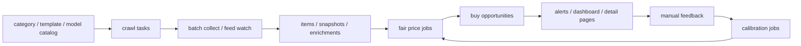

# 二手买入决策技术实施 Spec

Status: Draft v1
Updated: 2026-04-24
Workspace: `<repo-root>`

## 1. 目标定义

这份文档把系统未来的业务方向收敛为一个明确目标：

`持续监控目标品类价格，并用结构化数据帮助操作者更早、更稳地买到高性价比二手商品。`

系统不是泛化的“闲鱼采集平台”，而是偏买方视角的“二手买入决策助手”。

系统未来的核心输出不应只是图表，而应是：

- 这条商品是否值得买
- 合理价格是多少
- 当前价格便宜了多少
- 风险在哪里
- 是否应该现在提醒

## 2. 北极星与业务指标

### 2.1 北极星目标

在目标品类内，持续发现：

- 低于合理买入价
- 风险可控
- 转手不差
- 值得立即关注

的商品。

### 2.2 核心业务指标

第一阶段先定义 6 个核心指标：

- `fair_price`
  同型号同配置的合理市场价
- `buy_ceiling`
  建议买入上限
- `discount_rate`
  当前价格相对合理价的折价比例
- `opportunity_score`
  综合买入机会分
- `risk_score`
  风险分
- `alert_hit_rate`
  命中提醒后被人工判定为“值得看”的比例

第二阶段增加 4 个反馈指标。`open` 阶段必须来自真实 engagement 事件，例如 React 机会详情页写入 `detail_opened`，原始商品跳转写入 `listing_opened`；不能从页面访问假定：

- `watch_to_open_rate`
- `open_to_contact_rate`
- `contact_to_purchase_rate`
- `purchase_roi_estimate`

`purchase` 阶段必须尽量沉淀可计算结果证据。React 工作台和机会详情页的“已成交”动作应收集 `purchasePrice`、`expectedResalePrice` 和可选成交备注，用于生成 `roiEvidenceCount`、`averageExpectedProfit` 与 `averageExpectedRoiRate`，避免成交只停留在状态标签。

### 2.3 数据价值利用率

当采集覆盖已经足够大时，产品优先级必须从“继续获得更多数据”切换为“提高已有数据利用率”。

新增 `Data Value Cockpit` 作为买方工作台的第一屏产品判断：

- `itemCount`：有效商品库存
- `specCoverageRate`：结构化规格覆盖率
- `latestBaselineCount`：最新价格基线数量
- `opportunityCount` / `openOpportunityCount`：机会池与可行动机会
- `alertedOpportunityCount`：已进入提醒候选的机会
- `feedbackCount`：人工反馈
- `purchasedOpportunityCount`：成交证明
- `roiEvidenceCount`：可计算 ROI 证据
- `dataValueScore`：基于结构化、机会产出、反馈、成交和 ROI 的利用率分

产品诊断规则：

- 若 `feedbackCount = 0`，当前系统处于 `资源消耗态`：数据已产出机会资产，但业务价值尚未被证明。
- 若 `purchasedOpportunityCount = 0`，当前系统处于 `决策未兑现`：只能证明有人看过机会，不能证明机会能赚钱。
- 若 `roiEvidenceCount = 0`，当前系统处于 `ROI 缺证据`：成交状态不能独立证明收益质量。
- 只有产生成交与 ROI 证据后，系统才进入 `价值闭环学习中`。

运营原则：

- 不再把采集量当成主要进度。
- 当 OPEN 机会未被处理、反馈覆盖率接近 0 时，暂停无目的扩品类和泛采集。
- 每日优先消化 TOP OPEN 机会，并把打开、联系、不值得、成交与 ROI 证据全部回写。
- 规格补全优先服务于 OPEN / guidance-ready 机会，不做无差别全量补齐。

### 2.4 Daily Opportunity Pack

新增 `Daily Opportunity Pack` 作为 `Data Value Cockpit` 之后的第一屏执行层，目标不是展示更多数据，而是把 OPEN backlog 转成当日可完成的人工任务。

任务包合同：

- 默认目标为每日 `TOP 20` OPEN 机会。
- `act_now / 立即看`：高机会分、低风险、规格或基线足够可行动。
- `negotiate / 可砍价`：存在低于买入线、折扣明显或适合议价的价格信号。
- `needs_review / 需复核`：存在 MDM、企业机、账号锁、改装、维修、置换、非整机配件等风险信号，或风险分/基线状态需要人工排雷。
- `marketIntel`：从可靠基线中抽取今日议价锚点，辅助联系卖家时快速判断目标买入线。

任务包必须直接接入现有反馈闭环：

- `标记联系` 写入 `contacted`
- `跳过` 写入 `not_worth_it`
- `记录成交` 必须填写 `purchasePrice`、`expectedResalePrice` 和可选备注
- 打开原始商品继续写入 `listing_opened`

## 3. 业务范围

### 3.1 纳入范围

- 目标大类持续监控
- 型号级和配置级价格基线
- 买入机会识别
- 风险提示
- 命中提醒
- 人工反馈闭环
- 看板与明细页

### 3.2 暂不纳入范围

- 自动下单
- 自动砍价或自动聊天
- 全站搜索
- 大规模多账号运营
- 平台真实成交口径

## 4. 当前系统与目标之间的差距

当前系统已经具备这些基础能力：

- 大类、模板、型号库和任务配置
- 批量搜索采集
- 首页 feed 监控
- `items`、`item_snapshots`、`item_spec_enrichments`
- 价格看板与型号聚合
- `outreach_records`
- resident runtime 和控制页

但距离“买入决策助手”还缺 5 个关键能力：

1. 缺少稳定的配置级 `fair price / buy zone` 生成链路
2. 缺少机会实体，而不仅是商品实体
3. 缺少买入风险模型
4. 缺少提醒订阅与反馈闭环
5. 缺少面向买方的页面与工作流

## 5. 产品主线

未来产品主线固定为四段：

### 5.1 段 1：持续采集

维持当前：

- `crawl_tasks`
- `crawl_task_query`
- `items`
- `item_snapshots`
- `item_spec_enrichments`

### 5.2 段 2：合理价建模

系统需要把“看很多价格”升级为“给出可执行的买入价区间”。

### 5.3 段 3：机会识别

系统需要把商品转成机会，而不是只展示原始列表。

### 5.4 段 4：提醒与反馈

系统要知道：

- 哪些机会值得提醒
- 哪些提醒真的有价值
- 哪些判断应该反向修正

## 6. 目标架构

### 6.1 业务架构

### 6.2 技术架构结论

- `collector` 继续承载采集和事实入库
- `analyzer` 开始承载合理价、机会分和反馈校准作业
- `web` 继续承载内部控制台与买入工作台
- `category/template/model catalog` 继续作为主配置源
- 不复用 `outreach_records` 表达买入机会，新增独立买方域表

## 7. 数据模型实施方案

## 7.1 保持复用的现有表

- `category`
- `category_runtime_profile`
- `category_attr_template`
- `category_model_catalog`
- `crawl_tasks`
- `items`
- `item_snapshots`
- `item_spec_enrichments`
- `daily_metrics`
- `model_scores`

这些表继续使用，不需要推倒重建。

## 7.2 建议新增的买方域表

### 表 1：`buy_watch_target`

用途：

- 记录用户真正关心的监控目标

建议字段：

- `id`
- `category_id`
- `model_catalog_id`
- `target_name`
- `profile_key`
- `status`
- `budget_ceiling`
- `desired_memory_gb`
- `desired_storage_gb`
- `desired_region`
- `max_listing_age_hours`
- `risk_tolerance`
- `notify_cooldown_minutes`
- `metadata_json`

### 表 2：`buy_price_baseline`

用途：

- 固化某个型号/配置/地区下的合理价结果

建议字段：

- `id`
- `category_id`
- `model_catalog_id`
- `baseline_key`
- `memory_gb`
- `storage_gb`
- `region`
- `sample_size`
- `median_price`
- `p25_price`
- `p75_price`
- `fair_price`
- `buy_ceiling`
- `confidence`
- `baseline_date`
- `payload`

### 表 3：`buy_opportunity`

用途：

- 将 `items` 转为“买入机会”

建议字段：

- `id`
- `item_id_ref`
- `category_id`
- `model_catalog_id`
- `watch_target_id`
- `baseline_id`
- `current_price`
- `fair_price`
- `buy_ceiling`
- `discount_rate`
- `opportunity_score`
- `risk_score`
- `status`
- `decision`
- `decision_note`
- `first_detected_at`
- `last_detected_at`
- `payload`

状态建议：

- `OPEN`
- `ALERTED`
- `DISMISSED`
- `CONTACTED`
- `PURCHASED`
- `EXPIRED`

### 表 4：`buy_opportunity_risk`

用途：

- 结构化记录风险因子

建议字段：

- `id`
- `opportunity_id`
- `risk_code`
- `risk_level`
- `detail`
- `evidence_json`

### 表 5：`buy_alert_event`

用途：

- 记录每次提醒触发和发送结果

建议字段：

- `id`
- `opportunity_id`
- `watch_target_id`
- `alert_channel`
- `alert_reason`
- `status`
- `sent_at`
- `payload`

### 表 6：`buy_decision_feedback`

用途：

- 建立人工反馈闭环

建议字段：

- `id`
- `opportunity_id`
- `feedback_type`
- `feedback_label`
- `operator_id`
- `feedback_note`
- `purchase_price`
- `expected_resale_price`
- `created_at`

## 7.3 数据模型原则

1. 不要把买入机会继续塞进 `outreach_records`
2. `items` 是事实层，不直接代表机会层
3. `buy_price_baseline` 是结果层，不回写覆盖原始指标层
4. `buy_opportunity` 允许重复重算，但要保证幂等更新
5. `buy_decision_feedback` 只追加，不覆盖历史

## 8. 服务层实施方案

## 8.1 新增服务模块

建议新增这些 service：

- `application/services/buy_watch_targets.py`
  维护监控目标
- `application/services/buy_price_baselines.py`
  生成与读取合理价
- `application/services/buy_opportunities.py`
  生成、更新和关闭买入机会
- `application/services/buy_alerts.py`
  判断是否需要提醒
- `application/services/buy_feedback.py`
  写入人工反馈
- `application/services/buy_dashboard.py`
  拼装买方视角页面数据

## 8.2 `analyzer` 需要正式承担的作业

建议把下列逻辑迁入 `apps/analyzer`：

- `fair price` 计算
- `buy ceiling` 计算
- `risk score` 聚合
- `opportunity score` 聚合
- 周报和日报生成
- 反馈校准任务

## 8.3 规则计算建议

### `fair_price` 计算

输入：

- `category_id`
- `model_catalog_id`
- `memory_gb`
- `storage_gb`
- `region`
- `recent active sample`

规则：

1. 只取近 `N` 天有效样本
2. 去掉明显异常低价和垃圾样本
3. 优先按同型号同配置建基线
4. 样本不足时逐级回退：
   - 同型号同配置
   - 同型号近似配置
   - 同系列
   - 同大类

输出：

- `median_price`
- `p25_price`
- `p75_price`
- `fair_price`
- `confidence`

### `buy_ceiling` 计算

第一阶段建议：

- `buy_ceiling = min(fair_price * discount_factor, p25_price + buffer)`

按大类支持配置化：

- `discount_factor`
- `buffer`
- `minimum_sample_size`

### `risk_score` 计算

风险因子建议至少包括：

- 标题疑似偏题
- 价格异常过低
- 卖家异常活跃
- 疑似配件/问题机
- 成色描述缺失
- 图片数过少
- 发布时间过久但未成交
- 规格识别置信度低

### `opportunity_score` 计算

建议采用：

`机会分 = 折价价值 + 转手能力 + 配置稀缺性 - 风险惩罚`

第一阶段不做 ML，全部做规则驱动和可解释输出。

## 9. Web 与交互实施方案

## 9.1 新增页面

建议新增 4 组页面：

### 页面 1：买入目标页

建议路由：

- `GET /buy/targets`
- `GET /api/buy/targets`
- `POST /api/buy/targets`

页面内容：

- 监控目标列表
- 每个目标的预算和约束
- 当前活跃机会数

### 页面 2：机会列表页

建议路由：

- `GET /buy/opportunities`
- `GET /api/buy/opportunities`

页面内容：

- 当前开放机会
- 折价幅度
- 合理价和买入上限
- 风险标记
- 提醒状态
- 人工决策动作

### 页面 3：机会详情页

建议路由：

- `GET /buy/opportunities/{opportunity_id}`
- `GET /api/buy/opportunities/{opportunity_id}`

页面内容：

- 当前商品
- 历史快照
- 合理价证据
- 风险解释
- 命中原因
- 人工反馈入口

### 页面 4：价格基线页

建议路由：

- `GET /buy/baselines`
- `GET /api/buy/baselines`

页面内容：

- 按型号和配置查看当前合理价
- 样本量和置信度
- 近 7 天变化

## 9.2 Dashboard 改造原则

当前 Dashboard 不再只回答“市场怎样”，还要回答“现在该看什么”。

建议首页新增卡片：

- 今日新机会数
- 高价值提醒数
- 高风险误报数
- 命中目标榜
- 近期最值得看的商品

## 10. CLI 与批处理实施方案

## 10.1 新增 CLI 命令组

建议新增 `buy` 命令组。

建议命令：

- `build-buy-baselines`
- `refresh-buy-opportunities`
- `show-buy-opportunities`
- `send-buy-alerts --dry-run`
- `apply-buy-feedback`
- `report-buy-alert-performance`

## 10.2 作业顺序

每天推荐顺序：

1. 更新采集事实层
2. 更新规格抽取
3. 刷新合理价
4. 刷新机会池
5. 发送提醒
6. 汇总效果报告

## 11. 详细执行步骤

以下步骤按“必须先做”的顺序列出。

### Phase 0：业务合同冻结

1. 冻结目标业务定义为“买入决策助手”。
2. 冻结第一批目标大类，只保留 `apple_m_series`、`garmin_watch`。
3. 冻结机会输出字段：
   `fair_price / buy_ceiling / discount_rate / opportunity_score / risk_score / decision_reason`。
4. 冻结第一阶段不做自动聊天和自动下单。
5. 在 `SPEC.md` 和本文件中固定主口径。

### Phase 1：数据模型落地

1. 新增 Alembic 迁移。
2. 创建 `buy_watch_target`。
3. 创建 `buy_price_baseline`。
4. 创建 `buy_opportunity`。
5. 创建 `buy_opportunity_risk`。
6. 创建 `buy_alert_event`。
7. 创建 `buy_decision_feedback`。
8. 为 `buy_opportunity.item_id_ref` 建唯一或半唯一幂等约束。
9. 为 `category_id / model_catalog_id / baseline_date` 建索引。
10. 补充基础 ORM 模型和序列化测试。

### Phase 2：合理价链路

1. 明确 baseline 生成输入规则。
2. 从 `items + item_snapshots + item_spec_enrichments` 抽取分析样本。
3. 实现异常样本清洗函数。
4. 实现配置回退链路。
5. 生成 `fair_price`。
6. 生成 `buy_ceiling`。
7. 将结果写入 `buy_price_baseline`。
8. 输出 CLI `build-buy-baselines`。
9. 为 Apple 和 Garmin 各跑一轮 sample dry-run。
10. 补单元测试和基线稳定性测试。

### Phase 3：机会池链路

1. 定义 `buy_opportunity` 开放条件。
2. 从最新 `items` 中筛选候选商品。
3. 关联 `model_catalog_id` 和 baseline。
4. 计算 `discount_rate`。
5. 计算 `risk_score`。
6. 计算 `opportunity_score`。
7. 写入或更新 `buy_opportunity`。
8. 同步写入 `buy_opportunity_risk`。
9. 对长期失效机会做关闭逻辑。
10. 输出 CLI `refresh-buy-opportunities`。

### Phase 4：提醒链路

1. 新增监控目标页与 API。
2. 建立 `watch_target -> category/model/budget` 配置。
3. 建立提醒判定规则：
   - 首次命中
   - 折价超过阈值
   - 风险不过高
   - 冷却期已过
4. 写入 `buy_alert_event`。
5. 先支持 `dashboard inbox` 或日志式提醒。
6. 所有提醒先 `dry-run` 验证。
7. 统计 `alert_hit_rate`。

### Phase 5：前端工作台

1. 新增买入目标页。
2. 新增机会列表页。
3. 新增机会详情页。
4. 新增价格基线页。
5. 在首页加入“今日机会”卡片。
6. 支持人工动作：
   - `dismiss`
   - `contacted`
   - `purchased`
   - `not worth it`
7. 支持风险明细查看。
8. 支持机会排序和筛选。

### Phase 6：反馈回流

1. 新增 `buy_decision_feedback` 写入接口。
2. 支持人工标注：
   - 推荐正确
   - 推荐错误
   - 价格不够低
   - 风险太高
   - 误识别型号
3. 建立每周反馈汇总任务。
4. 统计不同大类的误报原因。
5. 反推调整：
   - baseline 折扣系数
   - 风险权重
   - 型号识别阈值

### Phase 7：分析层收口

1. 在 `apps/analyzer` 新建买方分析作业模块。
2. 将 `fair price` 逻辑迁入 analyzer。
3. 将 `opportunity score` 聚合迁入 analyzer。
4. 将反馈校准迁入 analyzer。
5. `collector` 只保留事实采集、规范化和事实入库。

### Phase 8：resident runtime 收口

1. 为买入刷新任务定义单独运行契约。
2. 明确它是否属于 resident 任务。
   结论：`buy_jobs` 默认不纳入 resident runtime，而是作为 dashboard runtime control 下的按需分析单元。
   原因：
   - `build-buy-baselines`、`refresh-buy-opportunities`、`emit-buy-alerts` 都是有明确输入边界与自然终点的收敛作业
   - 它们更适合按类目、按操作员意图触发，而不是常驻空转
   - resident runtime 继续保留给浏览器、feed、review 这类需要持续观察或循环消费的单元
3. 明确 dashboard 控制页是否需要纳入 buy jobs 开关。
4. 如果纳入，统一 `start/stop/status` 语义。
5. 补健康检查：
   - baseline 最近生成时间
   - opportunity 最近刷新时间
   - alert 最近触发时间

## 12. 文件与模块建议落点

### 12.1 模型与迁移

- `apps/collector/src/goofish_insight/models.py`
- `apps/collector/alembic/versions/*`

### 12.2 服务层

- `apps/collector/src/goofish_insight/application/services/buy_watch_targets.py`
- `apps/collector/src/goofish_insight/application/services/buy_price_baselines.py`
- `apps/collector/src/goofish_insight/application/services/buy_opportunities.py`
- `apps/collector/src/goofish_insight/application/services/buy_alerts.py`
- `apps/collector/src/goofish_insight/application/services/buy_feedback.py`
- `apps/collector/src/goofish_insight/application/services/buy_dashboard.py`

### 12.3 Web 入口

- `apps/collector/src/goofish_insight/entrypoints/web/routers/buy.py`

### 12.4 CLI 入口

- `apps/collector/src/goofish_insight/entrypoints/cli/buy.py`

### 12.5 分析层

- `apps/analyzer/*`

### 12.6 前端模板

- `apps/web/templates/buy_targets.html`
- `apps/web/templates/buy_opportunities.html`
- `apps/web/templates/buy_opportunity_detail.html`
- `apps/web/templates/buy_baselines.html`

## 13. 验收标准

### 13.1 Phase 1-3 验收

- 能生成 Apple 与 Garmin 的合理价结果
- 能从最新商品里产出机会池
- 机会结果包含可解释理由
- 高噪声商品不会大面积误报

### 13.2 Phase 4-5 验收

- 监控目标可配置
- 命中机会可以被提醒
- UI 可直接支持人工筛选和决策

### 13.3 Phase 6-8 验收

- 人工反馈可以反向进入校准流程
- analyzer 真实承担价格与机会作业
- resident runtime 有统一健康契约

## 14. 风险与约束

- Apple 与 Garmin 的规格标准化质量决定 baseline 上限
- 低样本型号容易导致合理价不稳
- 配件、问题机、商家引流帖会持续制造噪声
- 如果机会域仍复用旧运营表，后续语义会再次混乱
- 如果 analyzer 不真正落地，系统会继续由 collector 过载承担分析逻辑

## 15. 当前建议的开工顺序

最推荐的实际开工顺序是：

1. 先做 Phase 0 和 Phase 1
2. 紧接着做 Phase 2 和 Phase 3
3. 先用内部页面和 dry-run 提醒验证价值
4. 再做 Phase 4 和 Phase 5
5. 最后做反馈闭环和 analyzer 收口

## 16. 技术说明书问题对照整改表

| `SPEC.md` 中的问题 | 本实施文档中的整改动作 | 对应阶段 |
| --- | --- | --- |
| `collector` 包同时承担采集、分析、运营与运行控制，职责过重 | 买方分析先以独立服务模块落地，稳定后迁入 `apps/analyzer`，`collector` 只保留事实采集与事实入库 | Phase 2、Phase 3、Phase 7 |
| `business_domain` 与 `category/template/model catalog` 双轨并存，概念成本高 | 买方新表只使用 `category_id`、`model_catalog_id`、`watch_target_id` 作为主业务锚点，不新增 `business_domain` 依赖 | Phase 1 |
| 商品结构化与标准型号库还没有完全变成决策主资产 | 合理价和机会识别必须基于 `item_spec_enrichments`、`category_model_catalog`、配置字段和最新价格快照 | Phase 2、Phase 3 |
| 消息与运营链路容易先于买入判断扩张 | 提醒链路先采用 dry-run 或 dashboard inbox，不做自动聊天、自动砍价、自动下单 | Phase 4 |
| Web 看板缺少买方决策工作台 | 新增买入目标、机会列表、机会详情、价格基线页面，并在 Dashboard 加今日机会卡片 | Phase 5 |
| 人工反馈没有反向进入价格和风险判断 | 新增 `buy_decision_feedback`，记录误报、成交、忽略和价格反馈，并用于后续阈值校准 | Phase 6 |
| 本地 resident runtime 与业务作业边界不够清晰 | 为 baseline、opportunity、alert 作业定义单独运行契约，再决定是否纳入 resident runtime 控制页 | Phase 8 |
| 集成验证仍偏薄 | 每个阶段至少补 metadata、service 或 dry-run 测试；涉及运行平面时补健康检查 | Phase 1 到 Phase 8 |

## 17. 本文件结论

未来业务方向已经可以明确收敛为：

`买方视角的二手机会发现与买入决策系统`

后续所有技术改造，都应围绕这个目标回答：

- 这项改造是否让合理价更稳定
- 是否让机会识别更准
- 是否让人工决策更快
- 是否让反馈闭环更强

如果答案不是，就不应成为当前阶段的主线工作。
