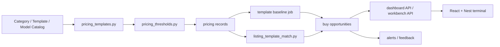

# 靠谱二手价格指导助手生产实施文档

Status: Draft v1  
Updated: 2026-04-10  
Workspace: `<repo-root>`

Related:

- [18-reliable-price-assistant-prd.md](<repo-root>/docs/18-reliable-price-assistant-prd.md)
- [19-reliable-price-assistant-technical-spec.md](<repo-root>/docs/19-reliable-price-assistant-technical-spec.md)
- [16-buy-side-implementation-spec.md](<repo-root>/docs/16-buy-side-implementation-spec.md)
- [dashboard-react-architecture.md](<repo-root>/docs/dashboard-react-architecture.md)

## 1. 文档目的

这份文档回答的是：

`基于当前 goofish-insight 的真实代码和运行方式，怎样把“模板级靠谱价格指导”稳稳落地到生产。`

它不是新的产品说明，也不是新的技术说明书，而是把已有目标转成：

- 可排期的实施阶段
- 可执行的模块改造任务
- 可验证的上线门槛
- 可回滚的生产切换方案

## 2. 生产目标

本次生产实施只围绕一个北极星：

`系统只对明确模板、且证据足够的二手商品给出价格指导。`

上线完成后，系统至少要做到：

1. 首页价格只对应唯一模板，不再出现规格混价
2. 模板未选完整时，不展示指导价
3. 机会识别先匹配模板，再做价格偏离判断
4. `reference_only` 与主机会池彻底分离
5. 趋势图与当前模板严格一致

## 3. 当前项目现状

当前项目不是空白起步，已经具备以下基础：

- 采集与事实层：
  - `crawl_tasks`
  - `items`
  - `item_snapshots`
  - `item_spec_enrichments`
- 配置与模板层：
  - `category`
  - `category_runtime_profile`
  - `category_attr_template`
  - `category_model_catalog`
- 价格与买方域：
  - `pricing.py`
  - `buy_price_baseline`
  - `buy_opportunity`
  - `buy_alert_event`
  - `buy_decision_feedback`
- 页面与操作台：
  - Python dashboard backend 仍是核心数据出口
  - React + Nest 新看板已独立运行

当前真正的缺口不是“没有系统”，而是：

`默认价格对象还没有彻底从 product 收口到 template。`

## 4. 实施原则

### 4.1 不推倒重来

继续沿用当前模块化单体方向：

- `collector` 继续承载采集、spec enrich、价格与买方域作业
- `web` 继续承载数据接口
- React + Nest 看板继续作为前端壳

本次实施不拆微服务，不重做数据库，不重写采集链路。

### 4.2 先合同，后切流量

优先落地统一合同：

- `pricingKeyFields`
- `templateKey`
- 模板完整度
- `availabilityTier`
- `baselineMatchLevel`

在合同未稳定前，不切首页主路径，不切提醒链路。

### 4.3 双写、灰度、可回滚

对 baseline、opportunity、trend 相关改造，统一采用：

1. 先双写
2. 再读优先切换
3. 最后正式收口

任何阶段都必须保留旧链路回退能力。

### 4.4 价格优先于样式

页面改造只服务于：

- 模板选择
- 模板价格
- 模板趋势
- 模板挂牌对比

本次生产实施不再以视觉优化为主驱动。

## 5. 实施范围

### 5.1 纳入范围

- 模板合同后端化
- 首页模板价格工作流
- baseline / opportunity 模板化
- 模板级趋势 v1
- watch target v2 兼容落地
- 验证、监控、回滚与上线流程

### 5.2 暂不纳入范围

- 自动交易
- 模型训练体系重构
- 全站品类一次性开齐
- 趋势物化 v2
- 完整 BI 报表化

## 6. 目标生产架构

生产重点不是新增多少服务，而是让这条链路里所有“价格输出点”都服从同一模板合同。

## 7. 分阶段实施方案

### Phase 0：合同冻结与品类表冻结

目标：

- 冻结技术说明书
- 输出首批品类 `pricingKeyFields` 设计表

交付物：

- [19-reliable-price-assistant-technical-spec.md](<repo-root>/docs/19-reliable-price-assistant-technical-spec.md)
- 各品类模板字段设计表

首批建议只做 4 个业务域：

1. Apple 电脑
2. Garmin 手表
3. 相机机身
4. 可换镜头

完成门槛：

- 每个品类都明确：
  - `pricingKeyFields`
  - 必填字段
  - 可选字段
  - 挂牌修正因素
  - `templateKey` 字段顺序

### Phase 1：后端模板合同落地

目标：

让后端先能明确回答：

- 当前价格对应哪个模板
- 为什么不给价
- 当前证据是否达到 `guidance_ready`

#### 代码改造点

优先新增或重构：

- `apps/collector/src/goofish_insight/application/services/pricing_templates.py`
- `apps/collector/src/goofish_insight/application/services/pricing_thresholds.py`
- `apps/collector/src/goofish_insight/application/services/listing_template_match.py`

需要接入或修改的现有模块：

- `apps/collector/src/goofish_insight/specs.py`
- `apps/collector/src/goofish_insight/pricing.py`
- `apps/collector/src/goofish_insight/application/services/dashboard_filters.py`
- `apps/collector/src/goofish_insight/application/services/dashboard_queries.py`
- `apps/collector/src/goofish_insight/entrypoints/web/routers/dashboard.py`

#### 实施任务

1. 在 active template metadata 中落地：
   - `pricingKeyFields`
   - 字段顺序
   - 必填字段
   - 模板完整度规则
   - 模板级阈值覆盖项
2. 在 `pricing_templates.py` 中单点实现：
   - `templateKey` canonicalization
   - 模板合同解析
   - 最终模板字段输出
3. 在 `pricing_thresholds.py` 中统一实现：
   - `availabilityTier`
   - `pricingBlockReason`
   - `pricingEvidence`
4. 让 dashboard filters / pricing API 输出：
   - 当前 active template
   - `pricingKeyFields`
   - `requiredFields`
   - `templateCompleteness`
   - `availabilityTier`

#### 完成标准

- 同一模板合同可被 dashboard、baseline、opportunity 复用
- `runtime_override` 只能切模板，不再改价格语义
- API 能返回不给价原因，而不是回退混合价格

### Phase 2：首页改造成模板价格工作台

目标：

让首页第一次真正成为“模板价格工作台”。

#### 页面行为

左侧：

- 品类
- 型号

右侧：

1. 模板属性选择器
2. 价格卡
3. 当前模板机会流
4. 当前模板趋势与参考成交

#### 实施任务

React 侧重点修改：

- `apps/dashboard-react/src/features/dashboard/hooks/useDashboardData.ts`
- `apps/dashboard-react/src/features/dashboard/store/dashboardUiStore.ts`
- `apps/dashboard-react/src/features/dashboard/components/*`

Nest 侧重点修改：

- `apps/dashboard-nest/src/dashboard-proxy.controller.ts`
- `apps/dashboard-nest/src/dashboard-proxy.service.ts`

具体要求：

1. 左侧只切 `category -> product model`
2. 右侧用模板字段选择器取代旧 spec label chip
3. 模板未完整时：
   - 不显示价格卡
   - 不显示混合趋势
   - 明确提示缺哪个核心字段
4. 模板完整且 `guidance_ready` 时：
   - 显示价格卡
   - 显示当前模板走势
   - 显示当前模板挂牌偏离
5. `reference_only` 时：
   - 允许显示参考价和参考趋势
   - 禁止输出“可执行收货价”

#### 完成标准

- 首页不再出现不同规格混价
- 首页不再出现与当前模板无关的趋势卡
- 用户能明确知道当前价格到底对应哪个模板

### Phase 3：baseline / opportunity 模板化收口

目标：

让价格基线、机会识别、提醒链路都以模板为主对象。

#### baseline 改造

重点模块：

- `apps/collector/src/goofish_insight/application/services/buy_price_baselines.py`

实施要求：

1. 保留旧 `baseline_key = view:label`
2. 双写：
   - `payload.pricingTemplate.templateKey`
   - `payload.pricingTemplate.templateLabel`
   - `payload.pricingTemplate.resolvedFieldValues`
3. 读路径切换为：
   - 优先 `templateKey`
   - 仅兼容期回退旧 `view:label`

#### opportunity 改造

重点模块：

- `apps/collector/src/goofish_insight/application/services/buy_opportunities.py`

实施要求：

1. 匹配顺序改为：
   - `templateKey`
   - 显式模板选择器
   - `spec`
   - `degraded_product`
   - `degraded_brand`
2. `degraded_product / degraded_brand`：
   - 只允许 `reference_only`
   - 不进入主机会池
   - 不触发提醒
3. 在 payload 中双写：
   - `matchedTemplateKey`
   - `matchedTemplateLabel`
   - `matchedFieldValues`
   - `templateAvailabilityTier`
   - `baselineMatchLevel`

#### watch target v2

实施要求：

1. 兼容期继续复用现有 `buy_watch_target`
2. 在 `metadata_json` 中新增：
   - `pricingSelector`
   - `pricingTemplateKey`
   - `pricingSelectorVersion`
3. 部分选择器允许表达“观察范围”
4. 部分选择器不得触发 `guidance_ready` 提醒

#### 完成标准

- baseline 与 opportunity 都可追溯到明确模板
- product / brand 回退不再冒充模板命中
- 非模板级命中不再写入 `BuyAlertEvent`

### Phase 4：模板级趋势 v1

目标：

让首页和工作台看到的趋势，不再是产品级替代趋势。

#### 实施方式

v1 先不加物化表，先用当前事实层完成可上线版本：

- 数据源：`ItemSnapshot`
- 归属规则：按 `snapshot_at` 时点对应的模板归属
- 聚合窗口：7 / 14 / 30 天
- 输出：
  - `median`
  - `p25`
  - `p75`
  - `sellerSampleCount`
  - `listingCount`

#### 代码改造点

- `apps/collector/src/goofish_insight/application/services/dashboard_queries.py`
- 新增模板趋势聚合服务

#### 强约束

1. 历史趋势不得按“今天的模板理解”回写
2. 若只能用过渡回放归属：
   - 趋势只能标为 `reference_only`
   - 不得为机会增加趋势加成

#### 完成标准

- 当前模板的趋势只来自当前模板样本
- 模板变更不会导致历史走势无提示漂移

### Phase 5：反馈与校准闭环

目标：

让“价格是否靠谱”能被运营反馈持续修正。

#### 实施任务

1. 记录模板匹配错误类型
2. 记录人工拒绝原因：
   - 模板错
   - 价格偏高
   - 样本不稳
   - 趋势不可信
3. 记录人工接受机会的模板命中情况
4. 将反馈回流给：
   - 模板字段设计
   - 阈值设置
   - 机会排序

#### 完成标准

- 反馈可以区分“模板错”与“价格错”
- 下轮调整能基于真实命中质量，而不是只看 UI 反馈

## 8. 数据迁移与切换策略

### 8.1 基本策略

统一采用三段式：

1. 双写
2. 读优先切换
3. 老字段降级为兼容

### 8.2 baseline

- 第 1 周：双写 `payload.pricingTemplate.*`
- 第 2 周：读路径优先 `templateKey`
- 第 3 周：旧 `view:label` 仅作兜底

### 8.3 opportunity

- 第 1 周：双写 `matchedTemplate*`
- 第 2 周：机会池只认模板级或 selector 级命中
- 第 3 周：product / brand 回退降为 `REFERENCE_ONLY`

### 8.4 watch target

- 先加 `metadata_json.pricingSelector`
- 观察 1 个迭代周期
- 稳定后再考虑升正式列

## 9. 生产开关与灰度策略

建议增加以下开关：

- `PRICE_TEMPLATE_CONTRACT_ENABLED`
- `PRICE_TEMPLATE_DASHBOARD_ENABLED`
- `PRICE_TEMPLATE_OPPORTUNITY_ENABLED`
- `PRICE_TEMPLATE_TREND_ENABLED`
- `PRICE_TEMPLATE_ALERT_STRICT_MODE`

切换顺序：

1. 先开合同计算
2. 再开首页模板模式
3. 再开 baseline / opportunity 模板严格模式
4. 最后开 alert strict mode

这样即使机会链路出现误杀，也不会先伤到核心采集和事实链路。

## 10. 测试与验收

### 10.1 单元测试

必须新增：

- `templateKey` 生成测试
- 模板完整度测试
- `availabilityTier` 门控测试
- `baselineMatchLevel` 降级语义测试
- `pricingSelector` 完整 / 部分选择器测试

### 10.2 集成测试

必须覆盖：

1. Apple 电脑完整模板给价
2. Apple 电脑缺字段不给价
3. Garmin 完整模板给价
4. 相机镜头部分选择器只出参考结果
5. product / brand 回退不触发 alert

### 10.3 前端验收

首页至少验证：

1. 左侧只切品类和型号
2. 右侧模板字段变化时只刷新当前模板数据
3. 未选完整模板时没有价格卡
4. 参考趋势不会混入其他型号

### 10.4 运行 smoke

生产前必须人工 smoke：

1. 选中 `Mac mini / M4`
2. 仅选 `M4`
   - 应提示模板未完整
   - 不显示指导价
3. 选 `M4 + 16G + 256G`
   - 若证据达标，应显示明确模板价格
4. 选 `Garmin Fenix 7X`
   - 必须按该品类模板字段渲染
   - 不能沿用 Apple 字段习惯
5. 降级命中机会
   - 只能进入 `REFERENCE_ONLY`
   - 不得触发提醒

## 11. 监控与运行指标

上线后至少监控：

- `guidance_ready` 模板数量
- `reference_only` 模板数量
- `blocked / incomplete` 模板数量
- 首页模板未完整占比
- 机会实体中降级命中占比
- alert 触发量与人工有效率
- 趋势接口空结果率

若以下指标异常，应立即回退：

- `guidance_ready` 数量一夜大幅归零
- 主机会池掉量超过 50%
- alert 有效率显著下降
- 首页大面积出现模板完整但不给价

## 12. 回滚策略

回滚必须是分层的，不是一键推倒。

### 12.1 页面回滚

- 关闭 `PRICE_TEMPLATE_DASHBOARD_ENABLED`
- 回退到旧参考展示逻辑

### 12.2 机会链路回滚

- 关闭 `PRICE_TEMPLATE_OPPORTUNITY_ENABLED`
- 保留 payload 双写，不删新字段

### 12.3 提醒回滚

- 关闭 `PRICE_TEMPLATE_ALERT_STRICT_MODE`
- 保留模板匹配日志，方便复盘

### 12.4 趋势回滚

- 关闭 `PRICE_TEMPLATE_TREND_ENABLED`
- 页面降级为不展示趋势，不展示替代趋势

这里的原则是：

`宁可临时少给结果，也不要重新放出混价结果。`

## 13. 里程碑建议

建议按 4 周节奏推进：

### Week 1

- 冻结品类 `pricingKeyFields`
- 完成模板合同服务
- 完成 `availabilityTier` 统一计算

### Week 2

- 首页模板选择器与价格门控上线到灰度
- baseline 双写
- opportunity payload 双写

### Week 3

- 机会链路切模板优先
- 降级命中从主机会池剥离
- 趋势 v1 接入首页

### Week 4

- alert strict mode 灰度
- 反馈闭环字段补齐
- 生产验收与文档收口

## 14. 角色分工建议

### 产品 / 策略

- 负责各品类 `pricingKeyFields` 冻结
- 负责 `reference_only` 与 `guidance_ready` 的业务口径

### 后端

- 负责模板合同、阈值、baseline、opportunity、trend
- 负责双写、回滚、监控开关

### 前端

- 负责首页模板工作流
- 负责不给价、参考价、指导价三类状态的清晰表达

### 运营 / 校准

- 负责模板匹配误差反馈
- 负责 alert 有效性抽检

## 15. Definition of Done

本项目达到本阶段 DoD，必须同时满足：

1. 首页核心价格只针对唯一模板
2. 模板未完整时绝不混价
3. 趋势只对应当前模板
4. `reference_only` 不进入主机会池
5. 降级命中不触发提醒
6. watch target 能表达结构化模板选择
7. smoke、集成测试、人工抽检全部通过

## 16. 本阶段结论

这次生产实施不是“再做一个更好看的 dashboard”，而是把整个系统重新校准为：

`模板优先、证据优先、宁可不给价也不混价。`

只要这条主线守住，Goofish Insight 才会真正从“强大的内部系统”进化成“靠谱的二手价格指导助手”。
