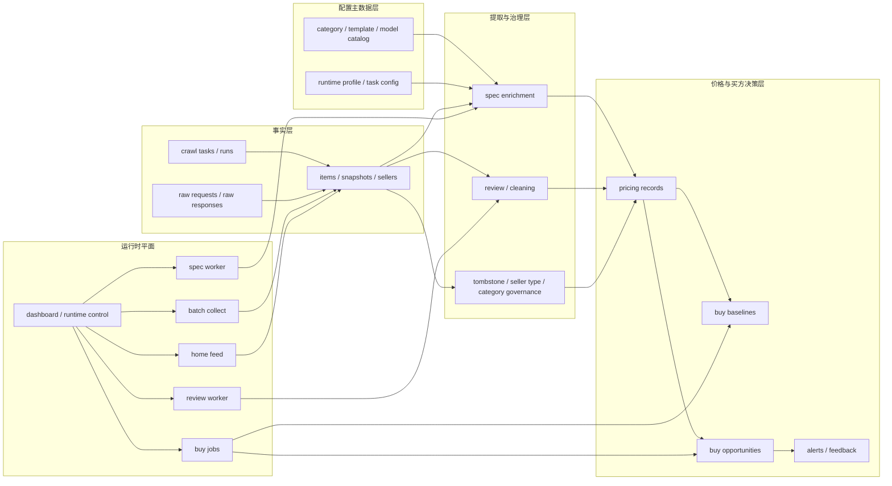

# Goofish Insight 最佳实践改造技术方案

Status: Draft v1
Updated: 2026-04-10
Workspace: `<repo-root>`

Related:

- [SPEC.md](<repo-root>/SPEC.md)
- [docs/08-architecture-refactor-spec.md](<repo-root>/docs/08-architecture-refactor-spec.md)
- [docs/16-buy-side-implementation-spec.md](<repo-root>/docs/16-buy-side-implementation-spec.md)
- [docs/19-reliable-price-assistant-technical-spec.md](<repo-root>/docs/19-reliable-price-assistant-technical-spec.md)
- [docs/20-reliable-price-assistant-production-implementation.md](<repo-root>/docs/20-reliable-price-assistant-production-implementation.md)

## 1. 文档目的

这份文档回答的是：

`基于当前 goofish-insight 的真实代码、真实数据和真实运行事故，怎样把系统收口到当前阶段的最佳实践。`

这里说的“最佳实践”不是抽象的大厂架构，也不是为了拆服务而拆服务。

本项目当前阶段的最佳实践定义是：

- 用模块化单体承载真实业务
- 用清晰的数据合同隔离事实、推断和决策
- 用可收敛的作业编排替代无限重试脚本
- 用严格资格门槛保证价格与机会计算可信
- 用统一运行合同控制本地执行平面和远端数据平面

这份文档的作用是成为后续系统改造的总技术方案。

之后如果要继续做价格、机会池、resident、LLM 清洗、规格提取或 dashboard 改造，默认先看本文件，再决定代码怎么动。

## 2. 当前判断

## 2.1 当前系统不是坏架构，但还不是最佳实践

当前系统已经有真实价值：

- 采集、快照、历史沉淀已经成型
- `category / template / model catalog` 已经形成正确主轴
- 买方域 `buy_*` 已经落地到数据库、CLI 和页面
- 规格提取、review、价格聚合、机会识别都不是空白设计

但当前系统仍有 5 个明确缺口，使它还达不到最佳实践：

1. 数据语义不够纯，兼容影子行会污染主链判断
2. resident 作业缺少统一收敛合同，容易反复重试和浪费 token
3. 价格资格门槛和规格资格门槛之前没有形成系统级合同
4. LLM 在不同链路中的职责边界不够统一
5. `collector` 仍过载，事实层、提取层、分析层和 runtime 层界限不够稳定

## 2.2 最近事故给出的教训

最近镜头 `spec-enrichment resident` 暴露了一个典型问题：

- 队列默认把所有 `partial` 都当成永久待处理
- worker 默认无限循环
- 没有冻结、退避、检查点和无进展停机逻辑
- 结果导致尾部样本反复重跑，业务有效去重条数不高，但 token 消耗被放大

这个问题不是单一实现细节，而是系统级作业合同缺失。

因此，这份最佳实践方案必须把“作业收敛合同”提升到和“数据合同”同样重要的层级。

## 3. 最佳实践目标架构

## 3.1 总体结论

本项目当前阶段的最佳实践目标架构应为：

`模块化单体 + 明确数据分层 + 明确运行单元 + 本地执行平面 / 远端数据平面`

不采用：

- 立即微服务化
- 立即引入 Redis / Celery / Kafka 之类的新基础设施
- 继续以 ad hoc shell 脚本作为唯一运行合同

## 3.2 目标分层

## 3.3 核心架构原则

### 原则 1：配置源单一化

长期主配置链路只能是：

`task -> category -> active template -> runtime profile -> model catalog`

不允许再新增绕开这条链路的平行配置体系。

### 原则 2：事实、推断、决策三层分开

- `items / item_snapshots / seller_profiles` 只表达市场事实
- `item_spec_enrichments / review` 表达结构化推断和治理结果
- `buy_price_baseline / buy_opportunity / buy_alert_event` 表达买方决策

三层之间可以引用，但不能语义混写。

### 原则 3：规则优先，LLM 只做补强

LLM 不能替代：

- 大类配置
- 模板定义
- 定价合同
- 永久垃圾规则
- resident 收敛策略

LLM 只能用于：

- 规格抽取补强
- 异常审查
- 低置信纠偏
- 无法通过规则稳定完成的结构化提取

### 原则 4：价格必须是“资格化输出”

系统不应该先给价格，再解释为什么可信。

正确顺序必须是：

1. 先判断该商品是否具备进入价格计算的资格
2. 只有满足资格合同，才允许输出价格、baseline 和 opportunity

### 原则 5：所有常驻作业必须可收敛

resident 不是“while true + launchd KeepAlive”。

resident 的最佳实践合同必须包含：

- 候选集装载规则
- 单轮处理上限
- 同结果冻结机制
- 多轮无进展退避
- 检查点和恢复点
- 业务进度指标
- 成本指标

## 4. 数据合同最佳实践

## 4.1 配置主数据合同

长期真相源：

- `category`
- `category_runtime_profile`
- `category_attr_template`
- `category_attr_template_item`
- `category_model_catalog`
- `category_model_alias`

约束：

- 模板定义价格语义
- `runtime profile` 只定义运行与展示语义
- `runtime override` 可以切 active template，不可以改写价格语义
- 任何价格 key 都必须从 template metadata 解释出来，而不是从页面临时拼出来

## 4.2 事实层合同

长期事实层主资产：

- `items`
- `item_snapshots`
- `seller_profiles`
- `crawl_runs`
- 必要时保留的 `raw_*` 证据

约束：

- 历史趋势必须建立在 `item_snapshots` 上，而不是只看当前 freshness window
- 永久垃圾不再写完整事实行，只保留 tombstone 最小记录
- `title_tokens` 这类中间产物不得回流数据库和提示词

## 4.3 结构化提取合同

首轮商品理解必须走 `enrich-specs`，而不是 `review-items-llm`。

首轮职责是：

1. 解析当前商品归属的大类
2. 加载 active template
3. 加载模板属性列表
4. 结合 title、tags 和源字段抽属性值
5. 写入 `item_spec_enrichments`
6. 回写必要的 `items.normalized_*`

结构化结果的状态只能是：

- `complete`
- `partial`
- `unresolved`
- `failed`

不允许再出现语义漂移状态，例如：

- `valid`
- `success`
- `resolved`

## 4.4 Review 合同

`review-items-llm` 和遗留别名 `review-items-llm-second-pass` 只能承担：

- 审查
- 异常校正
- 低置信复核

不能承担首轮规格抽取。当前正式二次清洗主链应走 `review-v3-second-pass` 与其 resident 运行时。

模型输出字段必须是白名单最小集。

必须做到：

- 只给模型真正需要的动态字段
- 不让模型回传无用原文
- `item_id` 必须保真
- 写库前再次做 schema 校验

## 4.5 价格资格合同

价格计算只能消费“合格的结构化规格”。

当前最佳实践口径定义为：

- `extractor_type = llm_review` 的影子规格，不进入价格池
- `status = unresolved` 的规格，不进入价格池
- `spec_confidence < 0.75` 的规格，不进入价格池
- 低置信 `partial` 可以保留在规格层，但不能自动抬升为价格事实

后续所有 `baseline / opportunity / dashboard pricing card` 都服从同一资格合同。

## 4.6 影子行治理合同

历史兼容影子行可以暂时存在，但必须明确：

- 不得参与价格计算
- 不得冒充主规格事实
- 必须可以被单独统计和逐步归档

也就是说：

`兼容存在 != 主链可用`

## 5. 作业编排最佳实践

## 5.1 所有批处理作业的统一合同

每个 job 必须回答清楚以下问题：

1. 候选集从哪里来
2. 一轮最多吃多少
3. 成功、部分成功、失败、冻结分别怎么定义
4. 什么时候重试
5. 什么时候退避
6. 什么时候退出
7. 业务进度怎么报
8. 成本怎么报

如果一个常驻任务回答不了这 8 个问题，就不应该进入 resident runtime。

## 5.2 Spec Resident 合同

`spec-enrichment resident` 的最佳实践规则：

- 只消费真正待提取或低置信、且明确需要复核的候选
- `partial + confidence >= 0.75` 默认冻结，不自动重排
- 连续多次得到同结果的样本冻结
- 连续多轮 `pending_after` 不下降时进入退避
- 进度指标必须至少包含：
  - 去重商品数
  - 新增 `complete` 数
  - 新增高置信可入价格池数
  - LLM 使用次数
  - token 成本

## 5.3 Review Resident 合同

`review second-pass` 的最佳实践规则：

- 只处理低置信或异常审查目标
- 与首轮规格提取彻底分离
- 不允许边清洗边直接改写主事实，除非进入独立 apply 阶段
- 低置信与 provider 失败必须可区分，不能把传输故障伪装成模型不确定

## 5.4 Baseline / Opportunity Job 合同

`build-buy-baselines` 与 `refresh-buy-opportunities` 必须满足：

- 按视图层级清晰刷新：`brand / product / spec`
- 同日 stale key 自动清理
- 价格资格合同与规格资格合同一致
- 所有机会结果都能追溯到：
  - 使用了哪个 baseline
  - 基于哪一条规格结果
  - 为什么进入或没进入机会池

补充运行面约束：

- `buy-jobs` 默认不进入 resident runtime
- 它应作为 runtime control 下的按需分析单元存在
- 只有当后续出现明确的周期性 SLA、冻结/退避/检查点合同，以及业务上确实需要持续无人值守刷新时，才考虑升级为 resident

## 6. 运行时最佳实践

## 6.1 运行单元正式化

建议把当前系统正式建模为以下运行单元：

- `web-api`
- `dashboard-shell`
- `browser-feed`
- `home-feed-watch`
- `browser-batch`
- `batch-collect`
- `spec-enrichment-worker`
- `review-worker`
- `buy-jobs`
- `model-gateway`

每个运行单元都必须有：

- 统一标签
- start / stop / status 语义
- 健康检查
- 日志路径
- 输入输出合同

其中：

- `buy-jobs` 的默认语义是“按类目触发的一次性分析作业”，不是无限循环 worker
- 它需要暴露最近 baseline / opportunity / alert 的健康摘要，但不应该为了控制页统一而被错误包装成 launchd resident

## 6.2 本地执行平面 / 远端数据平面

正式运行口径应该承认：

- 本地 macOS 承担浏览器、模型和 resident worker
- 远端 PostgreSQL 承担主要数据平面
- dashboard 同时承担业务页面和轻量运维入口

最佳实践不是否认这种架构，而是把它建模清楚。

## 6.3 成本与限流护栏

所有调用远端模型的任务都必须具备：

- 并发上限
- batch size 上限
- token 预算观察位
- provider 错误显式暴露
- 可人工停机
- 进度只按去重商品数汇报，不得用重试次数虚增

## 7. 模块边界最佳实践

## 7.1 `collector` 的最终职责

`collector` 长期只保留：

- 采集事实入库
- 配置读写
- 结构化提取
- 轻量应用服务编排
- API 出口
- runtime control

## 7.2 `analyzer` 的最终职责

`analyzer` 应逐步接手：

- fair price 建模
- opportunity score
- 风险校准
- 反馈回流
- 离线报表和专题分析

## 7.3 不再允许的坏味道

- 把新的分析逻辑继续堆进 `collector` 超级模块
- 把页面临时筛选逻辑变成价格语义
- 在 CLI 里长期写大段业务逻辑
- 让 shell 脚本成为唯一运行合同
- 让历史兼容数据悄悄进入主决策链

## 8. 最佳实践改造分阶段实施

## Phase 0：合同冻结

目标：

- 冻结系统级最佳实践基线
- 冻结数据合同、作业合同和运行合同

执行步骤：

1. 完成本文件并挂到根入口文档
2. 为 `spec / review / pricing / buy` 明确单一合同
3. 停止新增平行实现路线
4. 给后续改造建立统一验收口径

完成标准：

- 所有人以同一术语描述事实层、提取层、决策层
- 代码和文档中不再混淆“首轮提取”和“review 清洗”

## Phase 1：数据语义清理

目标：

- 让事实、规格、影子、价格资格之间的边界稳定

执行步骤：

1. 持续清理 `item_spec_enrichments` 中的历史影子语义
2. 为影子行建立清晰隔离视图或兼容标识
3. 保证所有新写入都带正确 `confidence` 与 `status`
4. 统一 `title > 500` 等硬垃圾规则与 tombstone 合同
5. 明确 seller heuristic 与平台真标识的边界

完成标准：

- 新数据不再制造新的语义漂移
- 价格链路不再误吃兼容影子行

## Phase 2：首轮提取收口

目标：

- 把 `enrich-specs` 变成全域首轮主链，而不是只在单品类局部可用

执行步骤：

1. 先做 Apple / Garmin 的模板字段和规范值收口
2. 继续保留镜头类目的前置过滤、shorthand 收敛和非目标拦截
3. 将 rule-first + llm-fallback 正式做成统一模式
4. 对每个品类明确：
   - required fields
   - partial 冻结规则
   - non-target 规则
   - shorthand 归一化规则
5. 为首轮提取增加“新增高置信 complete 数”进度指标

完成标准：

- 首轮提取不再只有镜头成熟
- Apple / Garmin 也能稳定产出高置信规格

## Phase 3：价格与买方决策收口

目标：

- 让价格、baseline、opportunity 全部建立在同一资格合同上

执行步骤：

1. 固化 `pricing eligibility` 合同
2. 刷新 baseline 生成逻辑，确保 stale key 清理和解释信息齐全
3. 让 opportunity 只消费合格的价格事实
4. 将页面上的价格说明补成可解释输出
5. 让 homepage pricing / focus / trend 与 CLI pricing 命令都消费同一份可读 summary 合同
6. 在 buy 域中补足反馈回流后的阈值校准路径
7. 给 pricing record 增加统一 `spec_source` 快照，明确区分正常规格、运行时规则结果与历史影子行

完成标准：

- 同一商品在 dashboard、baseline、opportunity 中看到的一致是同一条价格语义
- 页面、CLI、机会池不再各自维护不同的价格解释文案
- 页面、CLI、机会池都能解释当前规格证据到底来自正常提取、runtime 规则还是历史影子行
- 机会池不再因为低置信规格漂移而失真

## Phase 4：resident runtime 产品化

目标：

- 把 resident 从脚本堆变成有合同的运行平面

执行步骤：

1. 为每个 resident 建立统一 start / stop / status / logs 契约
2. 补齐检查点、冻结、退避和限流
3. 给 dashboard runtime 页补充统一指标说明
4. 对远端 provider 任务加入成本守卫与一键停机能力
5. 停止使用“旧日志 + 人工推断”判断运行状态

完成标准：

- resident 能长期运行但不会无限空转
- 进度指标真实反映业务产出而非重试次数

## Phase 5：分析层收口

目标：

- 把长期分析能力从 `collector` 中拆出明确边界

执行步骤：

1. 在 `apps/analyzer` 建立价格和校准作业入口
2. 迁移 fair price、机会评分和反馈校准作业
3. 保留 `collector` 作为事实入库和 API 出口
4. 为 analyzer 增加独立 smoke 和回归检查

完成标准：

- `collector` 不再持续膨胀
- 分析作业有稳定归属

## 9. 最佳实践下的文件与模块落点

### 9.1 继续保留但要瘦身的模块

- `apps/collector/src/goofish_insight/cli.py`
- `apps/collector/src/goofish_insight/specs.py`
- `apps/collector/src/goofish_insight/pricing.py`

### 9.2 应继续拆出的服务模块

- `application/services/spec_candidate_queue.py`
- `application/services/spec_worker_state.py`
- `application/services/pricing_eligibility.py`
- `application/services/buy_job_runtime.py`
- `application/services/runtime_health.py`

### 9.3 建议补的基础设施适配层

- `infra/ai/provider_client.py`
- `infra/runtime/launchd_contract.py`
- `infra/browser/session_gateway.py`

说明：

这些不是要求现在立刻重构全部代码，而是给后续改造一个稳定落点，避免再把临时逻辑堆回超级模块。

## 10. 验收标准

系统达到本阶段最佳实践，至少要满足：

1. 首轮提取、review、价格资格三条合同边界清楚
2. 影子规格不会再污染主价格链
3. resident 任务具备冻结、退避、检查点和真实进度口径
4. 所有远端模型任务具备成本守卫与可停机能力
5. 价格、baseline、opportunity 输出语义一致
6. 文档、脚本、控制页与实际运行合同一致

## 11. 当前最推荐的开工顺序

不建议再继续横向铺新功能。

当前最推荐顺序是：

1. 先完成本文件所述合同冻结
2. 紧接着补 Apple / Garmin 首轮规格提取收口
3. 再校准价格资格与机会池解释信息
4. 然后再恢复 resident 长跑
5. 最后推进 analyzer 拆分

## 12. 本文件结论

当前 goofish-insight 最需要的不是“更多功能”，而是：

`让已经存在的能力按最佳实践收口，减少语义漂移、无限重试和不可信价格输出。`

这份方案把最佳实践落成了 5 个中心目标：

- 单一配置主轴
- 清晰数据合同
- 可收敛作业编排
- 严格价格资格门槛
- 明确运行时平面

后续只要新增改造不能同时增强这 5 件事之一，就不应该成为当前主线。
