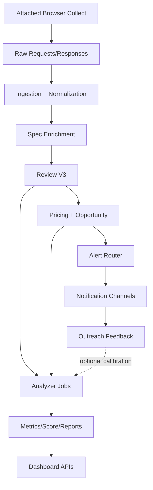
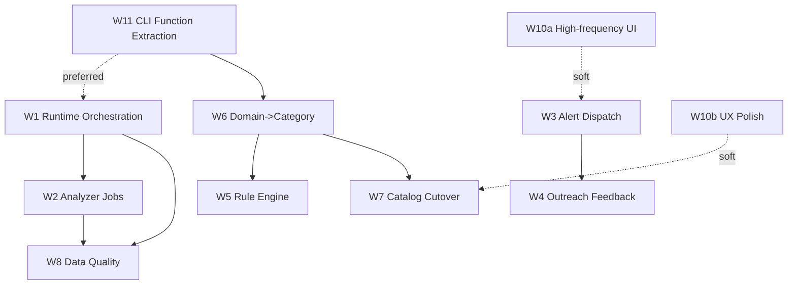

# Goofish Insight 全面技术改造升级说明书（V1.7）

- 文档日期：2026-04-13
- 适用范围：`<repo-root>`
- 文档目标：将本轮全面 Review 问题转化为可执行的架构升级方案、实施路线与验收标准
- 当前状态：待实施（本文件为主实施合同）

## 0. 修订记录与决策

### 0.1 V1.7 修订摘要（基于七次评估反馈）

1. 将 Phase 0 拆分为 `P0a 安全优先` 与 `P0b 技术底座` 两个批次，避免启动周同时做安全和 schema 变更。
2. W2 收缩为 Phase 1 的 `daily_metrics_job` MVP，`model_scores_job` 与 `analysis_reports_job` 后移到 Phase 2。
3. 增加 `price_sanity_score` 合理区间初始化策略，明确历史样本与人工兜底配置来源。
4. W11 增加 `specs.py` 与 `pricing.py` 的债务评估输出要求，不再只覆盖 `cli.py`。
5. 为 W7/W9 增加 contract test，专门校验路径切换前后的 API 契约一致性。
6. 为 Phase 0-1 增加临时告警通道（`stderr` / 日志文件 / launchd failure action），不依赖 W3 才能收到 P1 告警。
7. 补充 `ui_event_log` 写入量估算与写入 QPS 预算，并与 Phase 1 压测门禁联动。
8. 在 Phase 1 和 Phase 2 之间增加 Buffer Week，用于吸收延期和技术债回补。

### 0.2 V1.6 修订摘要（基于六次评估反馈）

1. Phase 0 再细分为 W8 两批：Day 1-3 先稳定采集成功率，Day 5 再接 launchd 健康探针。
2. 安全动作前置强化：Day 1 第一优先级为 README 暴露 key 轮换，必要时执行 git 历史清理评估。
3. W11 -> W1 依赖从“硬阻塞”调整为“优先依赖”：W1 可在 `cli.py` 原位先落地，后续再外移。
4. W2 增加数据源合同：Phase 1-2 读旧路径，Phase 3 随 W7 切 catalog 读路径。
5. W9 增加“现状盘点结论”门禁：先确认 BFF 是否纯透传再决定 auth 迁移复杂度。
6. W10 验收改为“Phase 2 手动验收 + Phase 3 埋点自动化验收”两阶段。
7. 新增 coverage baseline 要求：Phase 1 Day 1 先跑覆盖率基线，再执行 65%/75% 增量目标。
8. DAG 补充 W5 节点与依赖关系，避免规则引擎成为隐式工作流。
9. W5 补充“样本回放工具链合同”（脚本、fixture、CI 报告产物）。
10. 修正文档路径与重复描述：`runtime_controls.html` 改为 `runtime.html`，清理重复行。
11. 补充 API 错误合同与限流约定（统一错误体、状态码语义、`request_id`）。
12. 补充数据保留策略（`ui_event_log`/`data_quality_metric`/`collector_job_run` 的保留与归档）。
13. 补充指标管道心跳监控与告警，避免“监控系统自身挂掉不可见”。
14. 增加 W1/W7 工作流级回滚 runbook 与事件分级响应链。
15. 增加性能预算与写入压测门禁（Phase 1）。
16. Phase 0 再减压：将覆盖率 baseline 与 W11 函数依赖清单后移到 Phase 1。

### 0.3 V1.4 修订摘要（基于四次评估反馈）

1. 架构表达统一为 DAG，删除线性主链描述，避免依赖误读。
2. W9 补充鉴权迁移合同：BFF 下线前必须完成 FastAPI 侧 auth 等价能力。
3. SQL 方案补齐关键索引：`notification_delivery` 重试索引、`collector_job_run` 活跃作业索引、`ui_event_log` 复合索引。
4. 增加 Phase 0 Day 1 迁移前自动备份策略（`pg_dump`）与回滚恢复步骤。
5. W8 新增 launchd 自身健康指标，避免“调度挂了但业务无感知”。
6. W5 补充 confidence 计算公式，明确 fallback 触发判定基础。
7. W7 增加阶段切换门槛（A->B 与 B->C 最低一致率），防止双读验证流于形式。
8. 增加 test database provisioning 方案，补齐集成测试环境落地细节。
9. Phase 1 新增内部子排序：`W11 -> W1 -> W2 -> W8 baseline`，W6/W10a 作为插槽推进。

### 0.4 V1.3 修订摘要（基于三次评估反馈）

1. 新增“必须完成 vs 条件完成”双梯队优先级，控制单人阶段范围膨胀风险。
2. W11 调整为前置执行：Phase 1 即启动 `cli.py` 采集核心函数外移，降低 W1/W6 冲突。
3. Phase 0 再收敛：安全修复 + W1 建表 + W8 基础指标接入，不再强行并行 W10。
4. W10 拆分为 W10a（高频路径）与 W10b（体验打磨），明确 W10b 可延期。
5. W5 增加“简版优先”策略：先做 alias 查表 MVP，第三品类接入后再扩完整 registry。
6. 增加工作流依赖 DAG，显式标注 blocking dependency 与 soft dependency。
7. W2 调度补充 catch-up 机制：launchd miss job 后自动补跑缺失窗口。
8. 补充测试基础设施：CI 触发策略、最小门禁、覆盖率与回归执行要求。

### 0.5 V1.2 修订摘要（基于二次评估反馈）

1. W11 修正方向：从“再拆命令入口”改为“迁移 `cli.py` 业务函数到 services 层”。
2. W1 补充 `collector_job_run` 与 `crawl_runs` 的关系合同与外键建议。
3. Phase 0 再收窄：W1 仅建表与 migration，不在首周改采集控制流写入。
4. 修正 Section 11 文件级清单路径，补齐 `new` 标注。
5. W3/W10 联动解耦：Phase 2 先写 preference，Phase 3 再接告警联动。
6. W9 增加 CORS 与生产部署拓扑前置条件（FastAPI + 反向代理）。
7. 架构图从线性链改为 DAG，明确 Analyzer 不依赖单一 Outreach 输入。
8. KPI 改为“基线校准后生效”，并新增 7 天 baseline 采集规则。

### 0.6 安全与范围决策

1. 不做完整安全专项（例如全量历史重写、统一密钥系统改造）作为本轮主线。
2. 但把“低成本高收益”的基础修复纳入 Phase 0 Day 1（最高优先）：
   - 清理 README 明文凭据示例
   - 清理 settings 默认真实连接样式
   - 轮换当前暴露风险 key（先轮换再改文档）
3. 对已进入 git 历史的高风险凭据，执行历史清理评估：
   - 私有内网仓库：可先轮换 + 标记历史风险
   - 存在外泄可能：执行 `git filter-repo`/BFG 清理
4. 上述基础修复作为发布前置检查，不再标记为 deferred。

### 0.7 既有文档一致性

1. 与 `SPEC.md`、`AGENTS.md` 保持一致：命令合同、运行合同、数据合同不冲突。
2. 与 `docs/23-best-practice-architecture-implementation-spec.md` 的关系：本说明书是执行收口版；若合同冲突，以本说明书为本次实施基线，并在 Phase 0 产出差异清单。

---

## 1. 背景与问题映射

本次改造针对以下核心问题族：

1. 运行稳定性与断点续跑语义不清，存在“看起来在跑、实际上停了”的风险。
2. 采集/清洗/分析/告警/运营未形成完整闭环，尤其是分析作业和消息触达。
3. 领域建模存在双轨：`business_domain` 与 `category` 并行、`items` 与 catalog 双轨并行。
4. 规则引擎仍以硬编码为主，扩展新品类成本过高。
5. Dashboard 存在双栈并行与 BFF 透传层价值不足。
6. 缺少统一的数据质量监控与端到端集成验收。
7. UI 交互路径偏长、页面割裂、缺少看板内行动闭环，影响买方效率。
8. 工程债务集中在超级模块与历史兼容层，影响迭代速度与可维护性。

### 1.1 问题 -> 改造工作流映射

| 问题域 | 改造工作流 | 目标结果 |
|---|---|---|
| 运行稳定性、重跑粗暴 | W1 运行时与编排升级 | 可观测、可恢复、可断点、可退避 |
| 分析层空壳 | W2 Analyzer 作业体系 | 指标与评分自动化产出 |
| 买方触达断裂 | W3 告警与触达通道 | 机会发现后可主动通知 |
| Outreach 无反馈闭环 | W4 运营反馈闭环 | 行动结果可追踪可学习 |
| 硬编码规则膨胀 | W5 元数据规则引擎化 | 新品类以配置接入为主 |
| domain/category 双轨债务 | W6 领域主键收敛 | `category` 成为唯一主语义 |
| catalog 写入无消费 | W7 数据路径收口 | dashboard 迁移到 catalog 读路径 |
| 质量监控缺失 | W8 质量与可观测体系 | 覆盖率、通过率、异常率、成功率可追踪 |
| 双 Dashboard 架构成本 | W9 前端架构收敛 | 去透传代理、减少维护面 |
| 交互路径深、操作断裂 | W10 UI 交互优化 | 快速定位、快速决策、看板内可行动 |
| 工程债务与历史残留 | W11 工程收口治理 | 降低 God module 风险与历史包袱 |

---

## 2. 改造目标与非目标

### 2.1 目标（必须达成）

1. 运行底座稳定：批采集具备明确状态机、断点语义、风控退避、失败可恢复。
2. 数据闭环完成：采集 -> 结构化 -> 评审 -> 定价 -> 机会 -> 触达 -> 反馈。
3. 分析能力独立：`apps/analyzer` 从空壳升级为可调度作业模块。
4. 模型与规则可扩展：新品类接入以模板/目录配置为主，避免继续堆 if-else。
5. 读写路径收口：以 `category + catalog` 为主线，保留旧路径仅作兼容层。

### 2.2 非目标（本轮不做）

1. 不做微服务化拆分。
2. 不引入复杂流处理平台（如 Kafka/Flink）作为前置条件。
3. 不做 UI 全量重设计。
4. 不做完整安全体系重构（但保留 Phase 0 的基础修复前置动作）。

### 2.3 优先级梯队（资源受限版）

在“单人/小团队 + 本地运行环境”约束下，工作流按两级执行：

必须完成（核心闭环，阻塞上线质量）：

- W1 运行时与编排升级
- W8 数据质量与可观测体系
- W2 Analyzer 作业体系
- W6 domain -> category 收口（持续推进）
- W11 工程收口（至少完成采集链路相关函数外移）

条件完成（业务增值，资源允许再推进）：

- W3 告警触达
- W4 Outreach 反馈闭环
- W5 规则引擎增强（先 MVP）
- W7 catalog 切主
- W9 去 BFF
- W10 UI 体验扩展项（W10b）

---

## 3. 目标架构（To-Be）



### 3.1 架构原则

1. 模块化单体优先：业务内聚在 Python 主后端，避免无价值中间层。
2. 状态优先于日志：关键运行状态必须落库可查询，日志仅做补充。
3. category-first：业务语义以 `category_id` 为主键，`business_domain` 只保留兼容读取。
4. 配置驱动优先：品类扩展以模板、目录、别名配置驱动。
5. 可观测优先：每条链路都要有可量化指标和失败归因。

### 3.2 工作流依赖 DAG（执行视角）



依赖说明：

1. blocking dependency：`W1 -> W2/W8`、`W6 -> W7`、`W3 -> W4`。
2. preferred dependency：`W11 -> W1/W6`，若 W11 受阻，W1 可先在 `cli.py` 原位落地并保留后续迁移任务。
3. soft dependency：`W10a -> W3`、`W10b -> W7`、`W6 -> W5`，可先独立交付再联动。

---

## 4. 工作流设计

## 4.1 W1 运行时与任务编排升级

### 4.1.1 现状问题

- 批采集存在窗口轮转，但“窗口提交语义”不够严格。
- 风控退避可运行，但缺少统一作业状态表作为运营视图来源。
- 失败重跑与游标推进边界不清。

### 4.1.2 目标设计

引入作业状态模型：

- `collector_job_run`：每次批任务执行记录（phase、start/end、exit_code、原因）。
- `collector_job_checkpoint`：游标、窗口、已提交批次、失败批次、恢复点。
- `collector_risk_event`：沿用 `batch_collect_risk_event`，补充作业关联字段。

### 4.1.3 状态机

1. `PROBE`：单品类探测（5s + 1 页）
2. `BATCH`：批量窗口执行
3. `COOLDOWN`：命中风控后关闭浏览器并静默
4. `RESUME`：冷却后重新进入 `PROBE`

### 4.1.4 断点语义（新合同）

- 语义 A（默认）：窗口“执行即推进”
- 语义 B（可切换）：窗口“成功提交才推进”

实现要求：

1. 在 `collector_job_checkpoint` 存储 `cursor_pending` 与 `cursor_committed`。
2. CLI 支持 `--checkpoint-mode eager|commit`（默认 `eager` 兼容现状）。
3. resident 模式建议切到 `commit`，避免风控时窗口持续前滚。

### 4.1.5 代码改造范围

- `scripts/start-batch-collect-resident.sh`
- `apps/collector/src/goofish_insight/entrypoints/cli/collect.py`
- `apps/collector/src/goofish_insight/cli.py`
- 新增：`apps/collector/src/goofish_insight/application/services/collector_runtime.py`

### 4.1.6 `collector_job_run` 与 `crawl_runs` 关系合同

1. `collector_job_run` 是“作业编排级”实体，描述一次 resident 周期内的 phase（probe/batch/cooldown）。
2. `crawl_runs` 是“采集执行级”实体，描述具体 query/task 的执行结果。
3. 关系约束：一个 `collector_job_run` 可以关联 0..N 条 `crawl_runs`。
4. 建议在 `crawl_runs` 增加可空外键 `job_run_id` 指向 `collector_job_run.id`。
5. 运行控制页读取口径：
   - 编排状态、游标与 phase：读 `collector_job_run` + `collector_job_checkpoint`
   - 采集成功率、pages_succeeded：读 `crawl_runs`

---

## 4.2 W2 Analyzer 作业体系落地

### 4.2.1 目标

将 `apps/analyzer` 从文档壳升级为可运行模块，承接以下任务：

1. `daily_metrics_job`
2. `model_scores_job`
3. `analysis_reports_job`

### 4.2.2 目录结构

```text
apps/analyzer/
  src/goofish_analyzer/
    jobs/
      daily_metrics.py
      model_scores.py
      analysis_reports.py
    services/
      metrics_builder.py
      score_builder.py
      report_builder.py
    cli.py
```

### 4.2.3 作业契约

1. 幂等：按 `date + category_id + model_id` upsert。
2. 失败可重跑：同日重复执行不重复膨胀。
3. 出口统一：产出写入 `daily_metrics`、`model_scores`、`analysis_reports`。

### 4.2.4 调度策略

- 每小时轻量增量更新
- 每天 02:30 全量重算前一日

### 4.2.5 调度实现（明确决策）

采用与现有 resident 体系一致的 launchd 调度：

1. 新增 `com.admin.goofish-analyzer-hourly` 与 `com.admin.goofish-analyzer-daily` 两个 plist。
2. 统一入口脚本：`scripts/start-analyzer-resident.sh`，内部按 job 参数调用 analyzer CLI。
3. `runtime_controls.py` 增加 analyzer 状态查询与手动触发接口，避免“调度存在但看板不可见”。
4. 不在本轮引入 APScheduler 或额外 cron 管理器，减少运行时复杂度。

### 4.2.6 launchd miss-job 补跑机制（catch-up）

1. 每个 analyzer job 维护 `last_success_at`（落库或状态文件持久化）。
2. 启动时计算缺失窗口：`(now - last_success_at)` 对应的小时/日粒度时间片。
3. 自动补跑策略：
   - 小时任务：最多回补最近 24 个窗口
   - 日任务：最多回补最近 3 天
4. 防抖与保护：
   - 单次启动补跑上限 `MAX_CATCHUP_RUNS`
   - 超限时写告警并等待人工确认
5. 验收：机器休眠跨过 02:30 后恢复，次日 10 分钟内能补齐前一日报告数据。
6. 资源受限兜底：若 Phase 1 进度紧张，允许将自动补跑实现顺延到 Phase 2 第 1 周，但 Phase 1 必须保留手动补跑命令。

### 4.2.7 Analyzer 数据源合同（分阶段）

1. Phase 1-2：Analyzer 默认读取旧路径 `items + item_spec_enrichments + review/pricing`，保证先运行稳定。
2. Phase 3：随 W7 切主后，Analyzer 逐步切到 catalog 路径 `product_spu/product_sku/product_spu_attr_value`。
3. 迁移要求：保留一版“双读对照”窗口，输出旧新路径差异报告后再关闭旧读。

### 4.2.8 Phase 1 MVP 收敛

1. Phase 1 只要求 `daily_metrics_job` 可运行、可手动触发、可幂等重跑。
2. `model_scores_job` 与 `analysis_reports_job` 默认后移到 Phase 2，与 W5/W7 结果一起接入。
3. Phase 1 验收不要求 Analyzer 全模块齐备，优先保证“有稳定增量指标产出”。

---

## 4.3 W3 告警触达闭环

### 4.3.1 目标

`BuyAlertEvent` 不再停留在 dashboard 被动查看，至少具备一种主动推送通道。

### 4.3.2 设计

新增通知抽象层：

- `NotificationChannel`：`webhook`、`email`、`telegram`（按配置启用）
- `notification_delivery`：记录发送状态、重试、错误
- `alert_dispatch_worker`：消费待发事件，重试退避

### 4.3.3 最小交付

1. 先支持 `webhook`（最通用）
2. 去重键：`alert_event_id + channel`
3. 至少三次重试 + 指数退避

### 4.3.4 与 W10 的联动合同

1. Phase 2 解耦：`listing_interest_click` 仅写入 `user_listing_preference`，不依赖 W3 告警链路。
2. Phase 3 再联动：当 W3 稳定后，才把 interest 事件纳入告警候选输入。
3. 联动条件：满足告警阈值（价格折扣、时效、去重）才触发 `BuyAlertEvent`。
4. 所有 UI 触发链路必须写入统一事件 ID，便于追踪“点击 -> 是否告警”。

---

## 4.4 W4 Outreach 行动反馈闭环

### 4.4.1 目标

完成“动作后结果”追踪，建立可训练的运营反馈数据。

### 4.4.2 数据模型

Phase 2 采用“最小可落地”方案，不引入三张新表，直接扩展 `outreach_records`：

- `outcome_status`（pending/contacted/skipped/won/lost）
- `deal_price`（可空）
- `closed_at`（可空）
- `operator_note`（可空）

### 4.4.3 关键字段

1. 是否已联系
2. 是否成交、成交价、成交时间
3. 人工归因备注（未成交原因、后续动作）

### 4.4.4 验收

- 每条 `outreach_record` 具备可更新结果状态，且可用于机会复盘统计。

### 4.4.5 能力升级边界

当且仅当系统具备“卖家回复数据源”后，再升级到线程/消息事件模型（`outreach_thread` 系列）。

---

## 4.5 W5 规则引擎元数据化

### 4.5.1 现状

`normalizers.py` 中大类规则硬编码，扩展成本随品类数量线性上升。

### 4.5.2 改造策略

1. 保留旧函数作为 fallback。
2. 新增 `rule_registry`，从 `category_model_catalog`、`category_model_alias`、`category_attr_template` 解析匹配规则。
3. 将 `pick_garmin_family_v3/pick_apple_family` 逐步迁移为配置规则。

### 4.5.3 规则表达（建议）

- token exact/contains
- alias 权重
- 品类优先级
- 配置冲突裁决策略

### 4.5.4 执行合同（补充）

1. 执行顺序
   - Step 1：先跑 `category_model_alias` 的 exact 匹配。
   - Step 2：再跑 alias contains 匹配。
   - Step 3：最后跑 template token 规则。
2. 多命中裁决
   - 优先级：`score` > `alias_weight` > `model_priority` > `updated_at`。
3. 配置来源
   - 主来源：数据库配置（catalog/alias/template）。
   - 备份来源：`apps/collector/configs/rule_fallback/*.json`（仅灾备或本地开发）。
4. fallback 触发条件
   - 新规则返回空结果，或置信度 < `RULE_MIN_CONFIDENCE`（默认 0.6）时，才进入旧函数分支。
5. 发布门禁
   - 每新增一个品类规则，必须提供 20 条样本回放与准确率报告（>= 85%）。

### 4.5.5 范围收敛（MVP -> 完整版）

1. Phase 2 先做 MVP：仅替换为 alias 查表 + 轻量优先级，不引入完整三层 registry 流程。
2. 当第三个品类（除 garmin/apple 外）进入生产前，再启用完整 `exact -> contains -> template` 链路。
3. 若 MVP 已满足准确率与维护成本，完整 registry 可延后到条件完成梯队。

### 4.5.6 置信度评分公式（用于 fallback 判定）

`confidence` 统一归一到 `[0, 1]`，默认公式：

`confidence = 0.45 * alias_score + 0.30 * token_score + 0.15 * attr_consistency_score + 0.10 * price_sanity_score`

其中：

1. `alias_score`：exact=1.0，contains=0.7，未命中=0。
2. `token_score`：命中模板 token 数 / 模板核心 token 数。
3. `attr_consistency_score`：提取属性与模板约束一致比例（无属性约束时取 0.5）。
4. `price_sanity_score`：价格落在品类合理区间时 1.0，否则按偏离比例线性衰减到 0。

判定规则：

1. `confidence >= 0.6`：接受新规则结果。
2. `0.4 <= confidence < 0.6`：写低置信日志并触发旧规则对照，不直接覆盖。
3. `confidence < 0.4`：直接 fallback 到旧规则结果。

### 4.5.9 `price_sanity_score` 区间初始化策略

1. Phase 2 MVP：优先使用近 30 天同品类有效样本的 `P10-P90` 区间作为合理价格带。
2. 若样本不足（默认 `<100` 条），回退到人工维护配置：`apps/collector/configs/price_sanity_ranges.yaml`（new）。
3. 配置字段最小集合：`category_code`、`min_price`、`max_price`、`updated_at`、`operator_note`。
4. 当历史样本区间与人工配置冲突时，以人工配置为准，并在回放报告中标记偏差。

### 4.5.7 样本回放工具链（门禁落地）

1. 提供回放脚本：`scripts/rules/run_rule_replay.py`（new），输入样本集输出准确率与混淆明细。
2. 测试夹具：`tests/fixtures/rule_replay/*.jsonl`（new），按品类维护 gold label。
3. CI 门禁：规则配置或 `normalizers.py` 变更时，自动执行回放并产出 `artifacts/rule_replay_report.md`。
4. 发布条件：未附回放报告或准确率未达门槛（>=85%）时，不允许合并规则 PR。

### 4.5.8 权重校准计划（MVP 后）

1. MVP 上线后收集 2 周回放样本，执行一次权重敏感性分析（网格搜索或贝叶斯优化均可）。
2. 评估维度：准确率、误判率、fallback 触发率、低置信占比。
3. 若候选权重在不升高误判率前提下准确率提升 >= 2%，允许灰度替换默认权重。
4. 权重调整必须附回放报告与回滚权重配置。

---

## 4.6 W6 `business_domain` -> `category` 收口

### 4.6.1 目标

在 2026-06-30 前完成“新代码不接受 `business_domain` 作为主参数”，并把历史引用降低到兼容层范围。

### 4.6.2 实施策略

1. 定义 API 新合同：主参数 `category_id`，`business_domain` 仅兼容输入。
2. 增加 lint 规则：新增业务逻辑禁止新增 domain 分支。
3. 从 Phase 1 开始按“单文件 PR”推进，不集中到 Phase 3。
4. 优先顺序：`pricing.py` -> `application/services/dashboard_queries.py` -> `application/services/catalog_backfill.py` -> `cli.py`。
5. 每个 PR 必须附“行为未变”回归测试或对照 SQL 样本。

### 4.6.3 验收标准

- 新增函数签名中 `business_domain` 占比降至 0（兼容层除外）。

### 4.6.4 工作量基线与节奏

1. 基线（评估口径）：`business_domain` 在代码库中为高频引用项（文件数与引用数均为高量级），需按周持续消减。
2. 周节奏：每周 1-2 个迁移 PR，每个 PR 只改一个核心文件，避免大爆炸式合并风险。
3. 里程碑门槛：优先完成 `pricing.py`、`dashboard_queries.py`、`catalog_backfill.py` 三处主链路后，再扩大到外围调用点。

---

## 4.7 W7 catalog 读路径落地

### 4.7.1 目标

dashboard 主查询逐步迁移到：

- `product_spu`
- `product_sku`
- `product_spu_attr_value`

`items` 退化为采集事实层。

### 4.7.2 分阶段

1. 阶段 A：双读比对（旧读 + 新读）
2. 阶段 B：默认新读，旧读兜底
3. 阶段 C：旧读下线

### 4.7.3 比对指标

- 主键覆盖率
- 价格一致率
- 属性完整率

### 4.7.4 阶段切换门槛（强约束）

1. A -> B（默认新读，旧读兜底）门槛：
   - 主键覆盖率 >= 95%
   - 价格一致率 >= 97%
   - 属性完整率 >= 90%
   - 连续 3 天满足门槛
2. B -> C（旧读下线）门槛：
   - 主键覆盖率 >= 98%
   - 价格一致率 >= 99%
   - 属性完整率 >= 95%
   - 连续 7 天满足门槛且无 P1 数据事故
3. 任一指标跌破门槛时，自动回退到上阶段并记录回退事件。

---

## 4.8 W8 数据质量与可观测体系

### 4.8.1 指标看板（最小集合）

1. 采集成功率（按任务/小时）
2. 风控命中率与退避时长
3. 规格抽取覆盖率
4. Review V3 通过率/拒绝率
5. 价格异常率
6. 告警触达成功率
7. launchd 作业健康度（collector/analyzer 的存活与最近心跳）

### 4.8.2 落地方式

- 新表：`data_quality_metric`
- 每小时写入聚合指标
- dashboard 新增“运行质量”页
- 唯一约束采用 partial index 分层建模，不使用 `coalesce(category_id::text, '')` 方案

### 4.8.3 launchd 健康探针

1. 指标定义：
   - `launchd_job_alive{job_name}`：最近 5 分钟是否有心跳（0/1）
   - `launchd_job_last_heartbeat_seconds`：距离最近心跳秒数
2. 数据来源：`runtime_controls.py` 周期采样 `launchctl list` + 作业状态落库。
3. 告警规则：连续 2 个采样窗口 `alive=0` 时触发 P1 运维告警。

### 4.8.4 指标管道心跳（监控的监控）

1. 新增管道心跳指标：`dqm_pipeline_last_write_at`、`dqm_pipeline_lag_minutes`。
2. 告警规则：最近 2 小时无 `data_quality_metric` 新写入时触发 P1 告警。
3. 兜底动作：自动触发一次聚合作业重跑；重跑失败则升级到人工处理。

### 4.8.5 Phase 0-1 临时告警通道

1. 在 W3 上线前，P1 告警通过以下临时通道送达：
   - `stderr` 输出到 launchd `StandardErrorPath`
   - 本地滚动日志文件
   - launchd failure action / 非零退出状态
2. runtime 页面同时展示最近一次临时告警摘要，避免纯日志埋没。
3. W3 上线后，临时通道保留一版周期作为兜底，不立即删除。

---

## 4.9 W9 前端架构收敛（去透传 BFF）

### 4.9.1 目标

降低系统复杂度，减少一层纯代理维护成本。

### 4.9.2 策略

1. React dashboard 直接调用 FastAPI JSON API。
2. NestJS BFF 进入冻结态，不再新增业务逻辑。
3. 完成 API CORS、鉴权、错误码规范后，逐步下线 BFF。

### 4.9.3 CORS 与部署前置（必备）

1. FastAPI 增加 `CORSMiddleware`，白名单最小化到 dashboard 域名与开发端口。
2. 开发拓扑：React dev(`5173`) 直连 FastAPI(`8791`) 仅用于本地开发。
3. 生产拓扑：通过 Nginx/网关统一域名反向代理，避免浏览器跨域复杂性。
4. 下线 BFF 前必须通过“跨域、鉴权、错误码一致性”三项 smoke 检查。

### 4.9.4 鉴权迁移合同（BFF 下线前）

1. 盘点现状：确认 NestJS BFF 是否承载 token 校验、会话透传、RBAC 或签名验签。
2. 等价迁移：若 BFF 承载鉴权逻辑，必须先在 FastAPI 侧实现等价 middleware/dependency。
3. 灰度策略：先双栈鉴权比对（BFF 与 FastAPI 同时校验但仅一个生效），连续 7 天无差异再切主。
4. 验收门禁：未完成鉴权等价迁移，不允许执行 W9 的 BFF 下线动作。

### 4.9.5 Phase 0 盘点结论（必填）

1. 在 Phase 0 完成 BFF 现状盘点并写入结论：
   - 是否纯透传
   - 是否存在 token 校验/会话处理/RBAC
2. 当前仓库初检结论（2026-04-13）：`apps/dashboard-nest/src` 未发现 guard/auth middleware/jwt 逻辑，暂按“纯透传”处理。
3. 若结论为“纯透传”，W9 可简化为 CORS + 错误码统一切换。
4. 若结论为“有鉴权逻辑”，必须走 4.9.4 的等价迁移流程。

---

## 4.10 W10 UI 交互优化与收口

### 4.10.1 目标

把“可看”升级为“可快速决策并立即行动”，优先优化高频买方路径。

### 4.10.2 问题分组与改造策略

1. 导航割裂（React + Jinja 混跳）
   - 短期：React Header 补全全部 Jinja 入口（含买方工作台），Jinja 页面加统一“返回看板”入口。
   - 中期：高频页面（买方工作台、配置管理）迁到 React；Jinja 仅保留低频运维页。
2. 首页路径过深（看价格需多步）
   - 增加全局快捷搜索/跳转，支持 `MBA M3 16 512` 直达。
   - 侧栏型号列表展示常见配置价格摘要，减少点击深度。
   - 记忆上次选择状态并自动恢复。
3. PriceGauge 缺少挂牌分布语义
   - 在标尺上叠加当前可见 listing 的价格分布点或密度条。
4. ListingsPanel 缺少排序筛选
   - 增加排序：价格升序、发布时间、机会分。
   - 增加筛选：地区、卖家类型。
5. 商品卡片缺少快捷行动
   - 增加“标记感兴趣”“不感兴趣”按钮。
   - 卡片展示 outreach 状态（已联系/已跳过/待跟进）。
6. FocusPanel 与 PricingPanel 信息重复
   - FocusPanel 改为跨型号机会对比（Top N opportunity），不重复当前型号价格卡。
7. 趋势图交互不足
   - 短期：hover 显示具体日期/价格。
   - 中期：引入轻量图表库支持时间窗口切换与多型号对比。
8. 运行控制页缺少确认
   - 对 stop/restart 增加二次确认（弹窗或长按）。
9. 中等屏幕响应式体验差
   - 768-1180 像素改为可收起抽屉或顶部 tab，不再单纯纵向堆叠侧栏。
10. LLM DevOps 页面组件内聚过高
    - `LlmOpsPage.tsx` 拆分为独立子组件（MessageCard/CodeBlock/TokenBar/LatencyBar）。
11. 缺少全局 loading/error 体验
    - 增加 dashboard 全局 skeleton 与统一错误聚合展示，减少 panel 逐个跳动。

### 4.10.3 API 与数据合同补充

为 W10 提供最小后端能力：

1. `GET /api/dashboard/search/suggest`：快捷搜索候选（型号、配置、别名）。
2. `GET /api/dashboard/sidebar/quick-prices`：侧栏常见配置价格摘要。
3. `POST /api/dashboard/listings/:item_id/interest`：标记感兴趣。
4. `POST /api/dashboard/listings/:item_id/dismiss`：标记不感兴趣。
5. `GET /api/dashboard/listings/:item_id/outreach-status`：卡片行动状态。
6. `GET /api/dashboard/listings/distribution`：价格分布数据。

建议新增表：

- `user_listing_preference`（interest/dismiss + 用户维度）
- `dashboard_user_state`（上次选择模型、筛选器、时间窗口）

### 4.10.4 验收指标（UI 专项）

1. 从进入首页到看到目标配置价格，操作步数中位数 <= 2。
2. 列表卡片内行动（感兴趣/不感兴趣）触发率 >= 40%（有机会列表场景）。
3. 运行控制误触导致 stop/restart 的事件数下降 >= 80%。
4. 768-1180 像素区间下核心视图区首屏可见率 >= 95%。
5. 首屏加载期间布局抖动显著下降（可用 CLS 近似指标跟踪）。

### 4.10.5 指标采集方案（可测性保证）

为避免“指标不可测”，新增前端埋点事件：

1. `dashboard_search_navigate`（记录从输入到命中配置耗时与步数）
2. `listing_interest_click` / `listing_dismiss_click`
3. `runtime_control_confirmed` / `runtime_control_cancelled`
4. `layout_breakpoint_render`（记录 768-1180 区间渲染模式）

落地方式：

- 前端埋点进入 `ui_event_log`（或既有事件日志表）
- analyzer 每小时聚合为 UI KPI 指标
- W10 KPI 全部以聚合结果为准，不再人工估算

### 4.10.6 W10a/W10b 分层实施

W10a（Phase 1-2，必须完成）：

1. 导航补全与回链
2. 全局快捷搜索直达
3. 运行控制二次确认
4. 列表卡片 interest/dismiss（仅 preference 写入）
5. 全局 loading skeleton 与错误聚合

W10b（Phase 3+，条件完成，可延期）：

1. PriceGauge 分布叠加
2. 趋势图高级交互（窗口切换/多型号）
3. FocusPanel 重构（跨型号机会）
4. 中等屏幕布局深度优化
5. LLM DevOps 页面组件化重构

### 4.10.7 验收方式分阶段

1. Phase 2：以手动验收为主（脚本化用例 + 录屏证据 + 操作步数抽样），不阻塞发布。
2. Phase 3：接入 `ui_event_log` 聚合后，切换为埋点自动化验收口径。
3. 若埋点链路异常，回退到手动验收兜底，避免“验收系统不可用导致功能无法发布”。

---

## 4.11 W11 工程收口治理

### 4.11.1 目标

降低超级模块与历史兼容残留导致的改造风险，提升后续迭代效率。

### 4.11.2 `cli.py` 拆分计划

1. 现状说明：命令入口已基本拆分到 `entrypoints/cli/*.py`，当前瓶颈是业务函数仍集中在 `cli.py`。
2. 拆分目标：把 `cli.py` 中采集/清洗核心函数迁移到 `application/services/*`，例如：
   - 浏览器与采集执行流 -> `application/services/collector_browser.py`
   - listing 清洗与过滤 -> `application/services/collector_ingest.py`
   - run 持久化与统计 -> `application/services/collector_runs.py`
3. `cli.py` 最终仅保留：
   - 命令注册
   - 轻量参数编排
   - 向 services 层分发调用
4. Phase 1 起每周至少拆分 1 组高耦合函数（不是重复拆命令入口）。

### 4.11.3 `item_spec_enrichments` 收口策略

1. 现有品类特定列（如 `case_size_mm`、`is_solar`、`chip_family`）标记为 legacy 输出。
2. 新品类字段统一落到 `category_attr_template + product_spu_attr_value`。
3. dashboard 读取优先级：通用属性模型 > legacy 列；legacy 仅兜底展示。
4. 在 Phase 2 完成字段使用审计，给出可裁撤列清单。

### 4.11.4 历史路径残留清理

1. 清理仓库内 Windows 路径残留目录与 README 无效路径示例。
2. 新增 CI 检查：禁止提交 `C:\\Users\\...` 形式路径文本与目录。

### 4.11.5 `cli.py` 拆分前置清单（Phase 0 输出）

1. 产出函数级依赖清单：入口函数、被调用链、数据库读写边界。
2. 按风险分组迁移批次：
   - Batch A：纯工具函数（低风险）
   - Batch B：采集执行流函数（中风险）
   - Batch C：写库/状态更新函数（高风险）
3. 每批迁移前后各跑一组等价回归，未通过不得进入下一批。

### 4.11.6 `specs.py` / `pricing.py` 债务评估输出

1. 当前体量参考：
   - `specs.py`：3003 行 / 111087 bytes
   - `pricing.py`：1454 行 / 51629 bytes
2. 本轮不强制拆分，但必须产出：
   - 函数级依赖图
   - 高耦合热点清单
   - 后续拆分建议（服务层 / 查询层 / 规则层）
3. 若 W6 迁移持续触碰 `pricing.py`，则优先对 `pricing.py` 做局部服务化拆分。

---

## 5. 数据库与迁移方案

## 5.1 新增表（建议）

```sql
-- 运行作业
create table if not exists collector_job_run (
  id uuid primary key,
  job_name text not null,
  phase text not null,
  status text not null,
  started_at timestamptz not null,
  finished_at timestamptz,
  exit_code int,
  metadata_json jsonb not null default '{}'::jsonb
);
create index if not exists ix_collector_job_run_job_status
  on collector_job_run(job_name, status, started_at desc);

create table if not exists collector_job_checkpoint (
  scope_key text primary key,
  checkpoint_mode text not null default 'eager',
  cursor_pending int not null default 0,
  cursor_committed int not null default 0,
  updated_at timestamptz not null
);

-- crawl_runs 与 job_run 关联（作业编排级 -> 执行级）
alter table crawl_runs add column if not exists job_run_id uuid;
alter table crawl_runs
  add constraint fk_crawl_runs_job_run
  foreign key (job_run_id) references collector_job_run(id);
create index if not exists ix_crawl_runs_job_run_id on crawl_runs(job_run_id);

-- 通知投递
create table if not exists notification_delivery (
  id uuid primary key,
  alert_event_id uuid not null,
  channel text not null,
  status text not null,
  attempt_count int not null default 0,
  last_error text,
  next_retry_at timestamptz,
  created_at timestamptz not null,
  updated_at timestamptz not null
);
create unique index if not exists ux_notification_delivery_event_channel
  on notification_delivery(alert_event_id, channel);
create index if not exists ix_notification_delivery_pending_retry
  on notification_delivery(next_retry_at)
  where status in ('pending', 'retrying');

-- 运营反馈（最小扩展）
alter table outreach_records add column if not exists outcome_status text;
alter table outreach_records add column if not exists deal_price numeric(12,2);
alter table outreach_records add column if not exists closed_at timestamptz;
alter table outreach_records add column if not exists operator_note text;

-- 质量指标
create table if not exists data_quality_metric (
  id bigserial primary key,
  metric_date date not null,
  metric_hour smallint not null,
  metric_key text not null,
  category_id uuid,
  task_key text,
  metric_value numeric(14,4) not null,
  metadata_json jsonb not null default '{}'::jsonb,
  created_at timestamptz not null default now()
);
create unique index if not exists ux_dqm_global
  on data_quality_metric(metric_date, metric_hour, metric_key)
  where task_key is null and category_id is null;

create unique index if not exists ux_dqm_task
  on data_quality_metric(metric_date, metric_hour, metric_key, task_key)
  where task_key is not null and category_id is null;

create unique index if not exists ux_dqm_category
  on data_quality_metric(metric_date, metric_hour, metric_key, category_id)
  where task_key is null and category_id is not null;

create unique index if not exists ux_dqm_task_category
  on data_quality_metric(metric_date, metric_hour, metric_key, task_key, category_id)
  where task_key is not null and category_id is not null;

-- UI 埋点事件
create table if not exists ui_event_log (
  id bigserial primary key,
  event_name text not null,
  user_id text,
  session_id text,
  event_time timestamptz not null default now(),
  payload_json jsonb not null default '{}'::jsonb
);
create index if not exists ix_ui_event_log_event_time on ui_event_log(event_time);
create index if not exists ix_ui_event_log_event_name on ui_event_log(event_name);
create index if not exists ix_ui_event_log_name_time
  on ui_event_log(event_name, event_time);
```

## 5.2 迁移顺序

1. 新表先加，不改旧逻辑。
2. 双写开关上线，灰度验证。
3. 读路径切换后再执行历史回填。
4. 稳定后裁撤兼容字段/逻辑。

## 5.3 迁移前备份与恢复（Phase 0 Day 1）

1. 执行任何 schema migration 前，自动执行 `pg_dump` 备份（结构 + 数据）。
2. 备份文件命名：`backup_<env>_<yyyyMMdd_HHmmss>.sql.gz`，保留最近 14 天。
3. 回滚演练要求：
   - 每周至少 1 次在测试库验证 `pg_restore` 可用性
   - 恢复后执行关键表行数与校验 SQL 对比
4. 发布门禁：当日备份失败时，禁止执行生产 migration。

## 5.4 数据保留与归档策略

1. `ui_event_log`：
   - 按月分区（或逻辑分表）存储
   - 在线保留 90 天，历史归档到冷存储
   - 基于当前“单人/小团队、本地运行”模式，初始预估为 `1k-3k events/day`，平均写入 `<0.1 QPS`，峰值预算 `<=5 QPS`
2. `data_quality_metric`：
   - 在线保留 180 天
   - 超期按日聚合下采样后归档
3. `collector_job_run/collector_job_checkpoint`：
   - 作业明细在线保留 180 天
   - 仅保留关键摘要长期存档
4. 归档作业必须可回放查询（至少支持按日期和任务检索）。

---

## 6. API 合同升级

## 6.1 采集控制 API

新增：

- `POST /api/runtime/collector/jobs/start`
- `POST /api/runtime/collector/jobs/stop`
- `GET /api/runtime/collector/jobs/status`
- `GET /api/runtime/collector/checkpoint`

返回统一字段：

1. `phase`
2. `status`
3. `cursor_pending`
4. `cursor_committed`
5. `active_risk_cooldown_count`

## 6.2 告警与触达 API

- `POST /api/alerts/dispatch`
- `GET /api/alerts/delivery/:id`

## 6.3 反馈 API

- `POST /api/outreach/records/:id/outcome`
- `POST /api/outreach/records/:id/status`
- `GET /api/outreach/records/:id`

## 6.4 UI 交互 API（W10）

- `GET /api/dashboard/search/suggest`
- `GET /api/dashboard/sidebar/quick-prices`
- `GET /api/dashboard/listings/distribution`
- `POST /api/dashboard/listings/:item_id/interest`
- `POST /api/dashboard/listings/:item_id/dismiss`
- `GET /api/dashboard/listings/:item_id/outreach-status`
- `POST /api/telemetry/ui-events`

## 6.5 Analyzer 运行控制 API（W2）

- `POST /api/runtime/analyzer/jobs/run`
- `GET /api/runtime/analyzer/jobs/status`
- `GET /api/runtime/analyzer/jobs/history`

## 6.6 API 错误合同与限流约定（最小版）

统一错误体：

```json
{
  "error_code": "string",
  "message": "human-readable summary",
  "detail": {},
  "request_id": "string"
}
```

约定：

1. 参数错误：`400`，`error_code=INVALID_ARGUMENT`。
2. 未授权/禁止：`401/403`，`error_code=UNAUTHORIZED/FORBIDDEN`。
3. 资源不存在：`404`，`error_code=NOT_FOUND`。
4. 冲突/重复：`409`，`error_code=CONFLICT`。
5. 限流：`429`，`error_code=RATE_LIMITED`，返回 `Retry-After`。
6. 内部错误：`500`，`error_code=INTERNAL_ERROR`，必须带 `request_id` 便于追踪。

---

## 7. 测试与验收

## 7.1 测试金字塔

1. 单元测试：规则引擎、价格归一、状态机转换
2. 集成测试：采集 -> 标准化 -> enrich -> review -> pricing -> alert
3. 端到端回放测试：mock payload + 固定期望结果
4. 契约测试：路径切换前后的 API schema / 字段语义一致性

## 7.2 新增必备集成场景

1. 风控连续命中 -> 退避倍增 -> 成功恢复
2. checkpoint commit 模式下失败不前滚
3. opportunity 生成后触发通知成功/失败重试
4. outreach 反馈回写并可在 analyzer 中读取
5. 全局快捷搜索可直达目标型号配置并恢复用户上次状态
6. 列表卡片行动按钮可落库并回显 outreach/interest 状态
7. 中等屏幕下侧栏可收起且首屏可见核心 workspace
8. `business_domain` 到 `category_id` 迁移后，旧接口兼容读行为一致
9. `cli.py` 拆分后命令入口与参数行为保持兼容
10. W7 新旧读路径下 dashboard section API 契约一致
11. W9 BFF 代理路径与 FastAPI 直连路径契约一致

## 7.3 验收 KPI（基线校准后生效）

1. 批采集任务 24h 内无“无状态卡死”
2. 采集成功率：较 Phase 0 基线提升 >= 15%，且目标值不低于 85%（剔除风控窗口）
3. 告警触达成功率：较基线提升 >= 10%，且目标值不低于 90%
4. 规格抽取覆盖率：较基线提升 >= 10%，且目标值不低于 80%
5. Review V3 失败可归因率 >= 98%
6. 目标配置价格查看路径中位步骤 <= 2
7. 看板卡片行动触发率：先以基线提升 >= 30% 为门槛，稳定后再收敛绝对值目标

## 7.4 KPI 基线采集规则

1. Phase 0 指标接入后，连续采集 7 天作为 baseline 窗口。
2. Phase 1 开始前冻结 baseline 报告，并在评审会上确认各 KPI 目标值。
3. 所有 KPI 评估必须同时展示“绝对值 + 相对基线变化”，避免失真判断。
4. 若 Phase 0 指标接入延迟，baseline 冻结日期按“接入稳定日 + 7 天”顺延，并同步调整 Phase 1 KPI 评审时间。

## 7.5 测试基础设施与 CI 门禁

1. 覆盖率基线（Phase 1 Day 1 必做）：
   - 先跑一次全量 coverage，生成 baseline 报告
   - Phase 1 目标按“绝对值门槛 + 相对基线提升”双口径评估
2. CI 触发：
   - 每个 PR 触发 `unit + selected integration`
   - 主分支合并前触发 `full integration + schema migration check`
3. 最小门禁：
   - 改动 `models.py/alembic` 必须跑 migration smoke
   - 改动 `cli.py/entrypoints/services` 必须跑 W1/W6 相关集成场景
   - 改动 `dashboard-react` 必须跑 W10a 关键路径测试
4. 回归基线：
   - 每周至少一次夜间全量回归，输出失败清单与 flaky 统计
5. 覆盖率要求（阶段性）：
   - 若 baseline < 30%，Phase 1 先以 50% 为过渡目标
   - Phase 1：核心服务层新增代码行覆盖率 >= 65%，且较 baseline 不下降
   - Phase 2 起：核心服务层新增代码行覆盖率 >= 75%，且较 baseline 持续提升

## 7.6 Test Database Provisioning（集成测试落地）

1. 提供独立测试库（PostgreSQL），与开发库物理隔离，禁止复用生产/开发实例。
2. CI 启动流程：
   - 启动测试数据库容器或独立实例
   - 执行全量 alembic migration
   - 加载最小 fixture（category/catalog/items/outreach）
3. 每个集成测试用例使用事务回滚或 schema reset，确保测试间无状态污染。
4. 输出要求：
   - migration 耗时
   - fixture 加载耗时
   - 失败时自动导出测试库快照与关键日志

## 7.7 性能预算与压测门禁

1. Phase 1 执行一次写入压测：
   - 目标对象：`data_quality_metric`、`ui_event_log`、`collector_job_run`
   - 指标：写入 QPS、P95 延迟、索引维护开销
   - `ui_event_log` 峰值预算：`<=5 QPS`
2. 慢查询预算：
   - 运行控制页核心查询 P95 < 300ms
   - Dashboard section API P95 < 500ms
3. 若压测结果超预算：
   - 优先优化索引与批量写策略
   - 暂缓非核心埋点扩张，避免放大写放大问题

---

## 8. 分期计划（按自然周）

## 8.1 Phase 0a（2026-04-13 ~ 2026-04-14，安全优先）

- Day 1 第一优先级：立即轮换 README 暴露 key，并完成 README 凭据清理
- 完成基础安全修复：默认连接样式修正、历史泄露风险评估（必要时历史清理）
- 执行 migration 前备份脚本连通性验证，但不在 P0a 做 schema 变更
- 若 key 轮换存在外部协调，优先保证安全动作完成，其余任务顺延到 P0b

## 8.2 Phase 0b（2026-04-15 ~ 2026-04-20，技术底座）

- 执行 migration 前自动 `pg_dump` 备份并验证可恢复
- 完成 W1 最小落地：`collector_job_run` + `collector_job_checkpoint` 建表与 migration（不改采集控制流写入）
- W8 第一批（Day 1-3）：只接入采集成功率与风控命中率并稳定出数
- W8 第二批（Day 5）：补 launchd 作业健康探针
- W8 基线窗口优先：指标先稳定，确保 7 天 baseline 能按时冻结
- 完成 W9 BFF 现状盘点与 Windows 路径残留清理

## 8.3 Phase 1（2026-04-21 ~ 2026-05-11）

- W11 前置：先外移采集链路高耦合函数（为 W1/W6 减冲突）
- 完成 W1 进阶能力：作业状态写入 + checkpoint `eager|commit` 模式与 resident 编排打通（允许先在 `cli.py` 原位实现）
- W2 仅交付 `daily_metrics_job` MVP + 手动触发 + runtime 可见
- Phase 1 Day 1 完成 coverage baseline 与 `cli.py` / `specs.py` / `pricing.py` 依赖清单
- W8 扩展指标接入并完成 7 天 baseline 冻结
- W6 启动渐进迁移：按单文件 PR 方式持续替换 `business_domain` 主参数
- W10a 第一批高频交互：导航补全、运行控制二次确认、全局快捷搜索、全局 skeleton

Phase 1 内部子排序（串行为主）：

1. 优先链：`W11 -> W1 -> W2(daily_metrics MVP) -> W8 baseline`
2. `W6/W10a` 作为插槽任务，不阻塞核心链路

## 8.4 Buffer Week（2026-05-12 ~ 2026-05-18）

- 仅处理 Phase 1 延期项、稳定性问题与回归缺陷
- 默认不新增条件梯队范围，除非核心梯队全部达标
- 若 `daily_metrics_job` 已稳定，可在本周补 `catch-up` 或最小 `model_scores_job`

## 8.5 Phase 2（2026-05-19 ~ 2026-06-15）

- W2 扩展：`model_scores_job`、`analysis_reports_job`、`catch-up` 机制
- W3 Webhook 告警通道上线并稳定运行
- W4 Outreach 最小闭环（`outreach_records` 字段扩展）
- W5 规则引擎 MVP（alias 查表）覆盖第一批（garmin/apple），附回放准确率报告
- W7 catalog 双读验证
- W10a 高频路径补齐：侧栏价格摘要、列表排序筛选、卡片快捷行动（仅写入 preference，不联动告警）

## 8.6 Phase 3（2026-06-16 ~ 2026-07-07）

- W6 category 主语义收口
- W7 新读路径切主
- W9 去 NestJS 透传层（条件完成）
- W10b 收口：FocusPanel 重构、趋势图交互升级、响应式改造、高频 Jinja 迁 React（条件完成）
- W3/W10 联动接入：interest -> alert 候选链路灰度上线
- W11 收口：`cli.py` 拆分阶段验收与 `item_spec_enrichments` legacy 读写审计

## 8.7 阶段门禁与延期策略

1. 若核心梯队（W1/W8/W2/W6/W11）任一未达当期门禁，条件梯队自动顺延，不并行抢资源。
2. W10b、W9、W7 切主属于优先延期项，不影响核心闭环验收。
3. 每周评审按“阻塞项优先清零”执行，不以完成功能数作为唯一目标。
4. 并行上限：核心工作流同一时段最多 2 条在建，超过上限需在周评审中显式批准。

---

## 9. 风险与回滚

## 9.1 主要风险

1. 双读双写期数据不一致
2. 告警通道误触发导致噪声
3. 规则迁移期间准确率抖动

## 9.2 回滚策略

1. 所有关键开关配置化：`FEATURE_*`
2. 新链路保留旧链路兜底一版周期
3. 每次切主必须有回滚命令和回滚 SQL

## 9.3 工作流回滚 Runbook（最小集）

W1（checkpoint 模式）回滚：

1. 将 `checkpoint_mode` 切回 `eager`。
2. 停止 resident 采集进程，校验 `collector_job_checkpoint` 游标一致性。
3. 关闭作业状态写入开关，恢复旧运行状态读取口径。
4. 用最近一次稳定窗口重跑 1 个批次验证恢复结果。

W7（catalog 切主）回滚：

1. 关闭新读开关，恢复旧读路径为主。
2. 保留新读链路写入但停止对外查询，防止数据进一步污染。
3. 导出切换窗口差异报告（覆盖率/一致率）并定位异常维度。
4. 修复后先回到阶段 A 双读比对，再重新申请 A->B。

## 9.4 事件分级与响应链

1. P0：数据损坏/大面积不可用，5 分钟内响应，立即停变更并执行回滚。
2. P1：关键作业停摆或指标管道中断，15 分钟内响应，2 小时内恢复。
3. P2：局部功能异常或性能退化，4 小时内响应，当日修复或给出绕行方案。
4. 升级路径：值班负责人 -> 项目 owner -> 需要时触发跨服务协同。

---

## 10. 交付清单

## 10.1 文档交付

1. 本技术说明书（本文件）
2. 分工作流实施清单（后续拆分到 todolist）
3. 每阶段验收报告模板

## 10.2 代码交付（目标）

1. `apps/analyzer` 可运行作业模块
2. 采集状态机与 checkpoint 模式可切换
3. 通知投递与反馈回写链路
4. catalog 新读路径可灰度
5. React 看板完成高频交互优化与看板内行动闭环
6. `cli.py` 拆分完成第一阶段并保持命令兼容
7. `item_spec_enrichments` 完成 legacy 字段使用审计与通用属性切换计划

---

## 11. Phase 执行清单（文件级）

说明：以下路径中标注 `new` 的为计划新增文件或目录，未标注的均为当前仓库已存在路径。

### 11.1 Phase 0 清单

P0a 安全优先：

1. 安全基础修复：
   - `README.md`
   - `apps/collector/src/goofish_insight/settings.py`
   - 暴露 key 轮换记录与历史清理评估结论
2. 迁移前备份准备：
   - `scripts/db/backup_pre_migration.sh`（new）
   - 备份落盘目录与恢复演练记录

P0b 技术底座：

3. W1 最小状态落库：
   - `apps/collector/src/goofish_insight/models.py`
   - `apps/collector/alembic/versions/*`
   - `apps/collector/src/goofish_insight/application/services/runtime_controls.py`（只读接入，不改采集写入控制流）
4. W8 基础指标接入：
   - `apps/collector/src/goofish_insight/application/services/runtime_controls.py`
   - `apps/web/templates/runtime.html`
   - launchd 健康探针与告警规则
5. W9 现状盘点：
   - `apps/dashboard-nest/*`（确认是否纯透传/鉴权）
   - 盘点结论写回本说明书附录
6. 临时告警通道：
   - launchd `StandardErrorPath`
   - 本地滚动日志文件
   - failure action / 非零退出监测
7. Windows 残留清理：
   - 仓库根路径残留目录
   - `README.md`、docs 中无效路径

### 11.2 Phase 1 清单

1. W11 前置拆分（采集链路）：
   - `apps/collector/src/goofish_insight/cli.py`（高耦合函数迁出）
   - `apps/collector/src/goofish_insight/application/services/collector_browser.py`（new）
   - `apps/collector/src/goofish_insight/application/services/collector_ingest.py`（new）
   - `apps/collector/src/goofish_insight/application/services/collector_runs.py`（new）
2. W1 checkpoint 模式：
   - `apps/collector/src/goofish_insight/entrypoints/cli/collect.py`
   - `scripts/start-batch-collect-resident.sh`
   - `apps/collector/src/goofish_insight/cli.py`（作业状态写入接入点）
3. W2 analyzer MVP：
   - `apps/analyzer/src/goofish_analyzer/jobs/daily_metrics.py`（new）
   - `apps/analyzer/src/goofish_analyzer/services/metrics_builder.py`（new）
   - `apps/analyzer/src/goofish_analyzer/cli.py`（new）
   - `infra/launchd/com.admin.goofish-analyzer-hourly.plist`（new）
   - `scripts/start-analyzer-resident.sh`（new）
4. W6 渐进迁移（首批）：
   - `apps/collector/src/goofish_insight/pricing.py`
   - `apps/collector/src/goofish_insight/application/services/dashboard_queries.py`
5. W10a 第一批：
   - `apps/dashboard-react/src/*`（导航、搜索、skeleton、运行控制确认）
6. 测试基础设施：
   - CI workflow（migration smoke + selected integration）
   - test database provisioning 脚本与 fixture
7. 覆盖率基线：
   - CI 覆盖率报告产物（baseline）
8. W11 拆分前置：
   - `cli.py` / `specs.py` / `pricing.py` 函数依赖清单与 Batch A/B/C 迁移计划
9. W2 数据源合同：
   - analyzer 读路径配置（Phase 1-2 旧路径）

### 11.3 Phase 2 清单

1. W1 checkpoint 模式：
   - `apps/collector/src/goofish_insight/application/services/collector_runtime.py`（checkpoint 与作业状态协同）
2. W2 扩展：
   - `apps/analyzer/src/goofish_analyzer/jobs/model_scores.py`（new）
   - `apps/analyzer/src/goofish_analyzer/jobs/analysis_reports.py`（new）
   - `apps/analyzer/src/goofish_analyzer/services/score_builder.py`（new）
   - `apps/analyzer/src/goofish_analyzer/services/report_builder.py`（new）
3. W3 告警：
   - `apps/collector/src/goofish_insight/application/services/alert_*`
4. W4 最小反馈闭环：
   - `apps/collector/src/goofish_insight/models.py`（`outreach_records` 字段扩展）
   - `apps/collector/alembic/versions/*`
5. W5 规则引擎 MVP：
   - `apps/collector/src/goofish_insight/normalizers.py`
   - `apps/collector/src/goofish_insight/application/services/rule_alias_matcher.py`（new）
   - `apps/collector/configs/price_sanity_ranges.yaml`（new）
   - `scripts/rules/run_rule_replay.py`（new）
   - `tests/fixtures/rule_replay/*.jsonl`（new）
6. W10a 高频动作：
   - `apps/dashboard-react/src/*`
   - `apps/web/templates/*`（仅补回链路）
   - `user_listing_preference`（写入，不联动 W3）

### 11.4 Buffer Week 清单

1. 延期项消化：
   - Phase 1 未完成但阻塞核心链路的任务
2. 稳定性修复：
   - W1/W2/W8 回归缺陷与 flaky 测试
3. 可选补齐：
   - `daily_metrics_job` catch-up
   - 最小 `model_scores_job` 骨架

### 11.5 Phase 3 清单

1. W7 切主 + W9 收口（条件完成）：
   - dashboard 查询层与前端数据源切换
   - FastAPI 鉴权等价迁移验收（BFF 下线前置）
   - W7/W9 contract test 与旧路径对照报告
2. W10b 体验收口（条件完成）：
   - `apps/dashboard-react/src/*`
3. W11 收口验收：
   - `apps/collector/src/goofish_insight/cli.py`（瘦身验收）
   - `apps/collector/src/goofish_insight/entrypoints/cli/*`（注册层保持轻量）
   - `item_spec_enrichments` legacy 字段使用审计报告
4. W3/W10 联动灰度：
   - alert dispatcher 规则配置
   - interest -> alert 候选输入开关

## 12. 结论

本次升级不是“推倒重来”，而是围绕现有正确方向做收口：

1. 先把运行底座和观察面做扎实。
2. 再把分析与告警触达做成业务闭环。
3. 最后完成 category/catalog 主路径收敛，降低长期维护成本。

当本说明书全部达成后，Goofish Insight 将从“可运行的采集系统”升级为“可持续迭代的情报与决策系统”。
