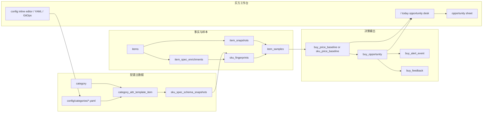

# Goofish Insight 全局再评估 v2 战略收口技术方案

Status: Draft v1
Updated: 2026-04-26
Workspace: `<repo-root>`

Related:

- [23-best-practice-architecture-implementation-spec.md](<repo-root>/docs/23-best-practice-architecture-implementation-spec.md)
- [32-dashboard-ui-design-system-migration-todolist-20260425.md](<repo-root>/docs/32-dashboard-ui-design-system-migration-todolist-20260425.md)
- [33-core-attribute-role-schema-spec-20260425.md](<repo-root>/docs/33-core-attribute-role-schema-spec-20260425.md)
- [34-core-attribute-role-schema-todolist-20260425.md](<repo-root>/docs/34-core-attribute-role-schema-todolist-20260425.md)
- [35-bloomberg-buy-terminal-ui-redesign-spec-20260425.md](<repo-root>/docs/35-bloomberg-buy-terminal-ui-redesign-spec-20260425.md)
- [PRODUCT_VISION.md](<repo-root>/docs/PRODUCT_VISION.md)
- [DESIGN_BENCHMARK.md](<repo-root>/docs/DESIGN_BENCHMARK.md)
- [36-bloomberg-buy-terminal-ui-redesign-todolist-20260425.md](<repo-root>/docs/36-bloomberg-buy-terminal-ui-redesign-todolist-20260425.md)
- [38-goofish-insight-global-reassessment-v2-todolist-20260426.md](<repo-root>/docs/38-goofish-insight-global-reassessment-v2-todolist-20260426.md)

## 1. 文档目的

本文件把“goofishInsight 全局再评估报告 v2”收口为可执行的产品、数据、工程、设计和合规总方案。

它不是新的宏大路线图，也不是替代既有专项 spec 的重写稿。它的职责是：

- 冻结全局北极星与反目标
- 把 10 个致命缺口转成有依赖关系的任务包
- 规定哪些现有文档继续作为专项基线
- 纠正评估报告中已被近期实现覆盖的旧判断
- 防止后续新增功能绕开 SKU 指纹、样本可靠度、token-only UI 和模块化单体这些主抽象

所有后续改动若涉及数据合同、dashboard 主流程、配置后台、价格基线、机会判断、合规边界或 runtime 收敛，都应先检查本文件和对应 todo。

## 2. 当前证据快照

本次收口以仓库当前状态为准。文档规划不能当作已交付能力。

### 2.1 已经收口的能力

- Dashboard UI 宪法已经落入 [32-dashboard-ui-design-system-migration-todolist-20260425.md](<repo-root>/docs/32-dashboard-ui-design-system-migration-todolist-20260425.md)。
- `/` 已经按 [36-bloomberg-buy-terminal-ui-redesign-todolist-20260425.md](<repo-root>/docs/36-bloomberg-buy-terminal-ui-redesign-todolist-20260425.md) 转为今日机会台，旧市场大盘降级到 `/market`。
- 设计 token、Light/Dark、`AppFrame`、`OpportunityCard`、`AnalyticsCard`、`KpiTile`、`PriceGauge` 已经成为 dashboard 主约束。
- `category_attr_template_item.role / weight / normalization / enum_values` 与 `sku_spec_schema_snapshots` 已经由 [33](<repo-root>/docs/33-core-attribute-role-schema-spec-20260425.md) 和 [34](<repo-root>/docs/34-core-attribute-role-schema-todolist-20260425.md) 定义并部分落地。
- `buy_price_baseline.schema_id` 已经接入 schema 快照，使当前价格指纹合同从纯 `baseline_key` 升级为 `baseline_key + schema_id`。
- Dashboard CSS 总量当前约 38KB，低于 40KB 预算。

### 2.2 仍未收口的缺口

- 本轮开始前仓库没有 `LICENSE` 和 `DISCLAIMER.md`，合规边界缺失。
- 显式 `sku_fingerprints` 与 `item_samples` 已落地，但仍需要继续把它们扩大到更多消费场景和回放验证。
- 样本可靠度合同已经开始显式化（effective sample count、recency weighted sample count、quality tier、confidence reasons），但成色修正器和冷启动邻近推理仍未完成。
- 配置页仍未完成 Inline Editor、YAML 互转和 GitOps 三视图。
- `apps/collector/src/goofish_insight/cli.py` 约 190KB，`specs.py` 约 115KB，`pricing.py` 约 81KB，巨型文件风险仍真实存在。
- `apps/android-overlay` 仍在主仓目录中，尚未作出 labs 化或独立仓库决策。
- `apps/web` 仍作为 Jinja legacy 层存在，部分 admin/support 路径仍依赖旧模板。
- `analyzer` 已承担部分买方服务，但 collector/analyzer 的职责边界仍未完全按文档理想形态收口。

## 3. 一句话判断

Goofish Insight 已经从“泛采集工具”收口为“本地优先的二手买方情报工作台”，但要达到 v1.0，必须继续把数据层的决策单元、UI 层的主工作流、工程层的模块边界和合规层的发布边界收成一套唯一抽象。

## 4. 北极星与反目标

### 4.1 北极星

`打开 dashboard 后，操作者能在第一屏用可信价格依据判断今天应该买、观察、跳过或继续取证的机会。`

### 4.2 三条唯一抽象

1. 数据层唯一抽象：`SKU 指纹 × 成色修正 × Tier 可靠度`
2. UI 层唯一抽象：`一行一机会 × 键盘流 × 抽屉详情`
3. 视觉层唯一抽象：`Token × 原语 × 复合件 × Bloomberg/Linear 参照系`

### 4.3 明确反目标

- 不把项目拉回泛采集平台叙事。
- 不做多租户 SaaS、计费、权限矩阵或平台化后台。
- 不引入微服务、消息队列、Redis 等基础设施作为当前阶段的默认答案。
- 不把 Android overlay 作为主线产品能力推进。
- 不让 LLM 替代类目配置、价格合同、样本资格或 runtime 收敛策略。
- 不新增绕开 token-only 和业务复合件的 dashboard 视觉体系。

## 5. 关键决策

### 决策 1：`/` 固定为今日机会台

`/` 是买方决策入口，不再承担空态首页或市场大盘入口。市场分析保留在 `/market`，运行、LLM、进度统一收口到 `/ops` 族路径。

当前状态：已由 UI 迁移和 Bloomberg benchmark todo 基本完成，后续只能增强机会台，不应反向恢复为 SaaS hero 或大盘首页。

### 决策 2：项目定位固定为 Local-First 买手工作台

数据库、浏览器会话、模型配置和凭据默认属于操作者本地或自管环境。v1.0 前不做 SaaS 化、多租户、用户计费和云端托管平台。

### 决策 3：Android overlay 退出主线

`apps/android-overlay` 只能保留为实验能力。下一步应选择：

- 移入 `labs/android-overlay`
- 或拆为独立仓库
- 或冻结为 archived experimental app

在决策完成前，不把 overlay 纳入主交付门禁。

### 决策 4：React 是唯一主工作台

`apps/dashboard-react` 是主工作台。`apps/web` 仅保留 legacy admin/support 和回查路径。Phase 3 前应给出 Jinja 物理删除或长期 support 边界。

### 决策 5：合规边界必须前置

仓库必须保留：

- AGPLv3 `LICENSE`
- `DISCLAIMER.md`
- README 中的许可证与免责声明入口

任何采集、resident 或浏览器自动化文档都必须继续强调：只处理公开可见列表字段，不触碰聊天、手机号、地址、实名等隐私信息，操作者自行承担平台 ToS、账号和当地法律合规责任。

### 决策 6：显式 SKU 指纹不得绕开 schema 快照

后续若新增 `sku_fingerprints` 与 `item_samples`，必须复用 `sku_spec_schema_snapshots.schema_id`。指纹 hash 必须包含 `schema_id`，不能基于未版本化模板或临时前端字段拼接。

## 6. 目标架构收口

## 7. 分流方案

### 7.1 合规与发布

本轮立即补齐 AGPLv3 和免责声明。后续公开 release 前必须完成：

- README 顶部声明项目身份、许可证和使用边界
- CHANGELOG
- v0.1.0 tag
- 最小可复现本地启动说明

### 7.2 SKU 指纹与样本事实层

当前阶段不应直接新增平行定价体系。正确路径是先做 ADR，再接入现有 `schema_id` 合同。

目标表意：

| 合同 | 作用 | 关键约束 |
|---|---|---|
| `sku_fingerprints` | 固化同一 schema 下的可决策 SKU | `schema_id` 非空，hash 包含 schema，locking attrs 不可变 |
| `item_samples` | 把 listing/snapshot 映射到某个 SKU 指纹下的可计价样本 | 保留 sample state、缺失字段、质量分、成色因子 |
| `buy_price_baseline` 演进或 `sku_price_baseline` | 按 fingerprint 输出 P15/P35/P50/MAD/Tier/Confidence | 不绕开现有 `buy_price_baseline`，需迁移 ADR |

样本状态建议：

- `eligible`
- `missing_required_attrs`
- `condition_unknown`
- `price_outlier`
- `stale`
- `rejected`

### 7.3 样本可靠度

每条 baseline 必须输出：

- `sample_count`
- `effective_sample_count`
- `recency_weighted_sample_count`
- `mad`
- `price_spread`
- `tier`
- `confidence_score`
- `confidence_reasons`

Tier 建议：

| Tier | 条件 | UI 语义 |
|---|---|---|
| A | 样本充足、时间新、离散低、schema 完整 | 可直接行动 |
| B | 样本基本可靠，有轻度不确定 | 可行动但需看证据 |
| C | 样本少或离散高 | 只作参考 |
| D | 数据不足或 schema 不完整 | 不给强买入建议 |

### 7.4 成色修正

成色修正器不应直接覆盖原价，而应产出可解释的 normalized price：

- `condition_grade`
- `warranty_state`
- `accessory_state`
- `damage_flags`
- `condition_multiplier`
- `normalized_price`
- `condition_evidence`

任何机会判断都必须能回溯到原价、修正因子和证据摘要。

### 7.5 冷启动与邻近推理

冷启动只允许输出带不确定度的参考区间，不允许伪装成成熟 baseline。

最低合同：

- `source_fingerprint_id`
- `neighbor_fingerprint_ids`
- `neighbor_distance`
- `prior_range`
- `uncertainty`
- `method`
- `expires_at`

### 7.6 配置后台

配置页的唯一正确抽象是三视图同源：

1. UI Inline Table Editor
2. YAML Editor
3. GitOps PR/Audit

长期真相源可以是数据库，也可以是 `config/categories/*.yaml`，但同一类目同一模板版本不能存在两个不一致的主源。落地前必须写清同步方向和冲突策略。

### 7.7 工程拆分

拆分目标不是为了文件更小，而是让变更范围可审计。

当前 P0 文件：

| 文件 | 当前约大小 | 目标 |
|---|---:|---|
| `apps/collector/src/goofish_insight/cli.py` | 190KB | 只保留兼容入口和注册 |
| `apps/collector/src/goofish_insight/specs.py` | 115KB | 拆成 extraction、normalization、schema、persistence |
| `apps/collector/src/goofish_insight/pricing.py` | 81KB | 拆成 records、eligibility、baseline math、serialization |
| `apps/collector/src/goofish_insight/application/services/runtime_controls.py` | 83KB | 拆成 process status、job commands、logs、health |

门禁建议：

- Python 单文件软上限 30KB
- CLI 子命令文件软上限 20KB
- 新增模块必须有 focused unit tests
- 拆分前先加 golden tests，再移动实现

### 7.8 视觉与设计系统

UI 主路线沿用 [35](<repo-root>/docs/35-bloomberg-buy-terminal-ui-redesign-spec-20260425.md)。

新增要求：

- `docs/DESIGN_BENCHMARK.md` 只保存可合法引用的文字参照、链接和自有截图；不得提交无授权的第三方产品截图。
- 新 UI 不得新增 raw hex、任意阴影、大圆角、大卡片机会列表或渐变装饰。
- 配置页也必须遵守同一套 token 和密度规则。

## 8. 12 周路线图

### Phase 1：止血与归一，Week 1-4

目标：把合规边界、数据主键、文件边界和设计门禁收稳。

交付：

- LICENSE + DISCLAIMER
- 产品愿景与设计 benchmark 文档
- 显式 SKU 指纹 ADR
- `sku_fingerprints / item_samples` 或等价演进方案
- 样本可靠度合同
- `cli.py / specs.py / pricing.py` 拆分第一批
- 配置完整性与文件大小门禁

### Phase 2：重构与美学升级，Week 5-8

目标：把第一屏决策、配置后台和基线解释做成稳定工作台能力。

交付：

- 配置页 Inline Editor
- YAML 与 UI 等价转换
- 基线 P15/P35/P50/MAD/Tier/Confidence 输出
- 详情 Sheet 中的 schema、样本、成色证据摘要
- `docs/DESIGN_BENCHMARK.md` 与 UI audit 联动
- Jinja legacy 路径裁剪计划

### Phase 3：智能化与规模化，Week 9-12

目标：把机会判断从静态看板升级为主动情报系统。

交付：

- 冷启动邻近 SKU 推理
- 成色修正器
- 趋势与预警信号
- 本地队列或 outbox 化重算
- 新品类端到端扩展
- feedback 反哺阈值和评分
- v0.1.0 release

## 9. 验收指标

### 产品

- 首屏到第一条机会不超过 1 次交互。
- 一屏至少 8 条机会。
- 每条机会能执行 watch、skip、contacted、purchased 或 open evidence。

### 数据

- Apple、Garmin、Camera 三条主类目 SKU 指纹命中率大于等于 90%。
- 每条 baseline 可回放到 `schema_id`、样本集合和计算日期。
- Tier D 不输出强买入建议。

### 工程

- Python 单文件最大值小于等于 30KB，或有明确豁免说明。
- Dashboard design-system check 常绿。
- `npm run verify-baseline` 作为发布前门禁。

### 合规

- `LICENSE` 存在。
- `DISCLAIMER.md` 存在。
- README 有使用边界入口。

## 10. 风险与缓解

| 风险 | 概率 | 影响 | 缓解 |
|---|---|---|---|
| 平台 ToS 或账号风险 | 中 | 高 | 保留免责声明、限速、只处理公开字段、不做自动交易 |
| 巨型文件拆分引入回归 | 高 | 中 | 先补 golden tests，按领域小步移动 |
| SKU 指纹过早建表导致双主键 | 中 | 高 | 先 ADR，强制依赖 `schema_id` |
| UI 重构变成视觉返工 | 中 | 中 | 以今日机会台为 benchmark，不做全站大爆炸 |
| 配置页三视图冲突 | 中 | 高 | 先定义单一真相源和冲突策略 |
| 冷启动模型误导决策 | 中 | 中 | 只输出不确定区间，不输出强机会分 |

## 11. v1.0 前必须完成

1. 合规文件和 README 入口完成。
2. SKU 指纹、样本可靠度、成色修正至少在 Apple/Garmin 端到端可用。
3. 今日机会台、详情 Sheet、反馈动作和 baseline 证据在主流程闭环。
4. 配置页支持可审计改动，不再依赖原始表单堆叠。
5. `cli.py / specs.py / pricing.py` 退出巨型单文件状态。
6. Android overlay 主线退出决策完成。
7. Jinja legacy 路径收敛到明确 support 边界。
8. v0.1.0 release 可按 README 在本地复现。
