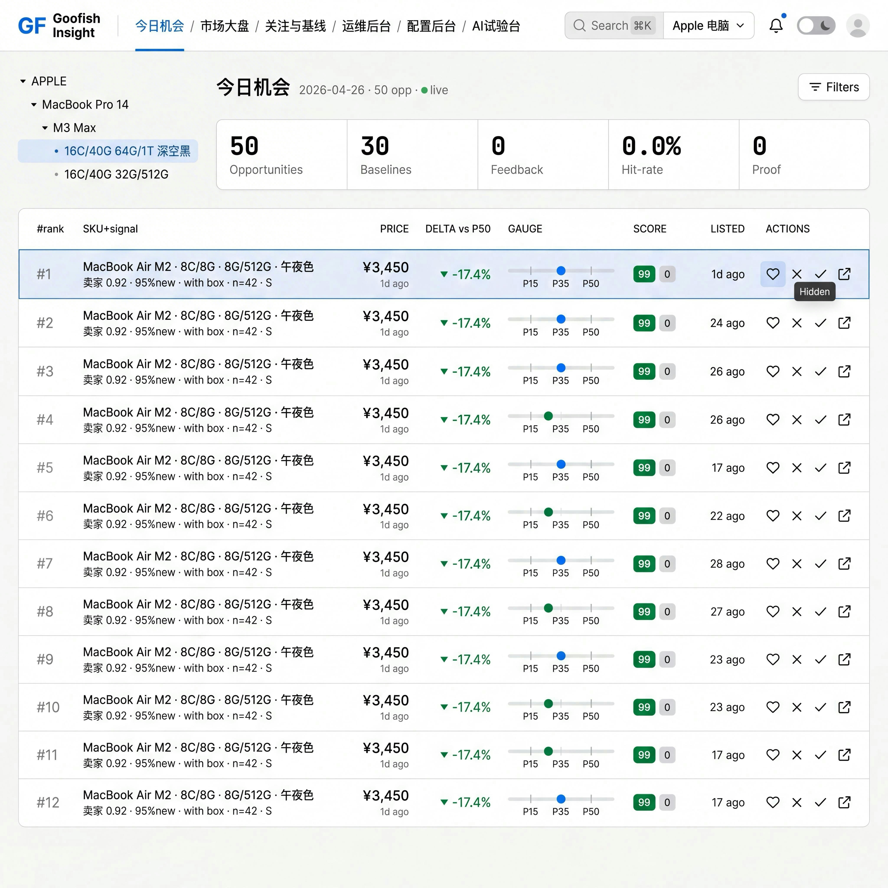
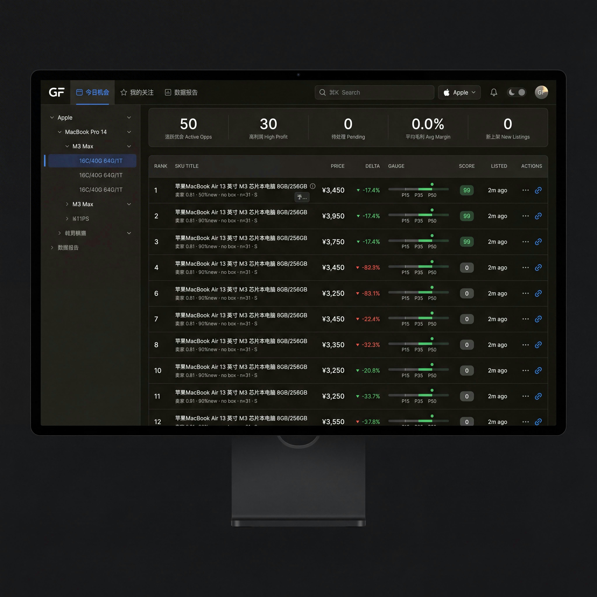
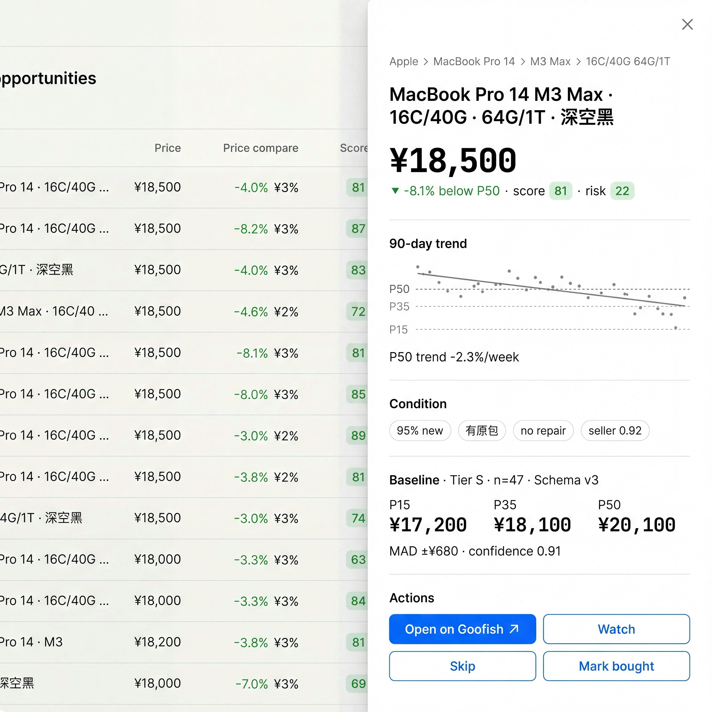

# 设计参照与视觉基准（Design Benchmark）

> 目的：防止 dashboard 在“技术实现”过程中漂移到无识别度风格；每次大改都回归本文件。

## 参照系（外部）

本项目不复刻外观，仅借鉴信息密度、层次、导航和密集数据面表达节奏。

- **Bloomberg Terminal（官方站点）**：<https://www.bloomberg.com/professional/products/bloomberg-terminal/>  
  参照点：信息优先级、表格式密度、告警与数据标注方式。
- **Linear（官方站点）**：<https://linear.app/>  
  参照点：命令式导航、布局稳定性、快捷键优先语义。
- **Notion Calendar（官方站点）**：<https://www.notion.com/product/calendar>  
  参照点：日常审美约束与交互清晰度（尤其是列表/筛选信息条）

| Bloomberg / Linear 参照点 | Goofish 金标准判例 | PR 对照要求 |
|---|---|---|
| Bloomberg Terminal：密集行情表、数字优先、低装饰 |  | Light 截图并排审读，首屏 10+ 行、不廉价 |
| Linear：单行导航、命令入口、稳定选中态 |  | Dark 截图并排审读，只换 token 不换版式 |
| Bloomberg / Linear：保留上下文的侧向下钻 |  | 详情必须 Sheet，不跳路由 |

## 金标准判例（今日机会台）

以下三张稿是 Goofish Insight dashboard 的唯一视觉金标准。UI 宪法 v2 是规则，本节是判例；当页面实现与判例不一致时，先对齐判例，再扩散到其他页面。

### 稿 1：今日机会台 Light

判例落点：

- 顶部导航单行 56px，命令搜索常驻，品类快切在同一行。
- 左栏至少四级下钻：品类、产品线、型号、SKU 指纹。
- KPI 横排 5 列，数字 display，标签 caption。
- 机会表一屏至少 10 行，目标行高 56px。
- 价格列 mono、tabular nums、`¥`、千分位，数值右对齐。
- DELTA 用 `▾ -17.4%` 或 `▴ +3.2%`，颜色只用于数值。
- inline `PriceGauge` 是价格基线唯一可视化方式。
- score / risk 用 badge，Actions 默认隐藏，hover 或 focus 出现。
- 发丝分隔、无阴影、6px 卡片圆角、零 emoji、零调试串。

### 稿 2：今日机会台 Dark

Dark 主题只换色，不换版式。底色、panel、hair、accent、up/down 必须走 v2 token；禁止科技炫光、渐变和装饰黑。

### 稿 3：SKU 指纹详情 Sheet

判例落点：

- 详情从右侧 Sheet 打开，背景表格仍可见，宽度约 480px。
- 面包屑最多 3 级，焦点价格 display 级 mono。
- 90 日趋势用极简 sparkline 和 P15/P35/P50 参考线。
- Baseline 区必须显示 Tier、`n=xx`、Schema。
- `Open on Goofish` 是 primary，Watch / Skip / Mark bought 是 secondary。
- 详情不跳路由，不显示调试 JSON，不混用中英 label。

## 参照规范（需长期保持）

1. **第一屏可决策性**  
   首屏必须先给机会，不给“空说明”。空态、欢迎说明、教学页均不是运营入口。
2. **密度优先，干扰最小**  
   同屏信息超过 8 条机会后仍可快速扫描；低价值装饰不得抢占主视觉。
3. **可解释性优先于花哨**  
   价格线、置信度、样本计数、Schema 版本与异常原因需固定显示。
4. **统一主题系统**  
   严禁新增任意裸色值；所有颜色、间距、圆角、阴影均通过 token 表达。
5. **键盘第一类交互**  
   J/K、G-系列、Enter、A/D、ESC 等主路径要有可见状态和快捷说明。

## Dashboard 验收入口

每次发布前至少执行一次：

1. `npm run design-system:check -w @goofish/dashboard-react`
2. `npm run design-system:audit -w @goofish/dashboard-react`
3. `npm run verify-baseline`
4. 机会页截图人工审读（Dark / Light）：确认主信息密度与可读性
5. 关键路径截图（今日机会台、机会详情抽屉、配置页）：保存在本地会议记录中

## 自有审计清单（必须逐项更新）

每次新增视觉组件前，记录：

- 组件用途（信息优先级）
- 目标 token（颜色/间距/字号/圆角）
- 是否需要支持 Light + Dark
- 与 `OpportunityCard`/`AnalyticsCard`/`KpiTile`/`PriceGauge` 关系
- 键盘状态流是否破坏 tab 顺序
- 触发该组件的业务动作与退出动作

## 资产与截图要求

- 任何最终设计参考图建议使用“本项目截图”或内部演示截图；不引入版权争议较高的外部 UI 图片。
- 新截图文件建议统一放到 `docs/design-benchmarks/`，命名格式：
  - `dashboard-opportunity-YYYYMMDD-dark.png`
  - `dashboard-opportunity-YYYYMMDD-light.png`
  - `dashboard-config-YYYYMMDD.png`

## 版本约束

- 本基准用于 v1.0 前冻结，任何偏离都需在对应 PR 说明中给出“参照系差异”理由。
- 设计系统优先级高于页面级微调，统一交给设计 token 与复合组件层解决。
