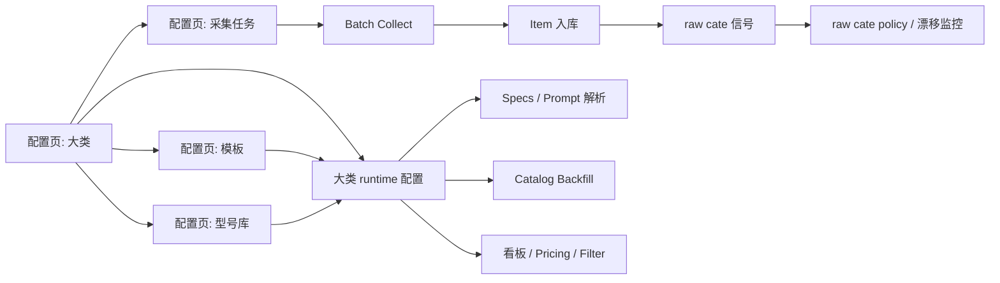

# 大类驱动配置与采集技术说明书

更新时间：2026-04-06 20:35:00 CST

## 1. 目标与结论

本期正式收敛的主架构是：

`采集任务 -> 大类 -> 生效模板 -> prompt_profile -> 型号库 -> 看板/回填/分析`

这里的关键决策有 4 个：

1. 不再把 `raw cate -> 大类` 作为主配置入口  
   `raw cate` 保留，但降级为辅助信号、漂移监控、黑白名单与 override。

2. 不再依赖“大模型先拉一批样本来模糊定义大类”  
   大类、属性、模板、prompt 由人配置；模型只做辅助建议。

3. 不再把 `business_domain` 当作长期业务主键  
   未来的真正业务主键是“大类”，实现上优先复用现有 [`category`](<repo-root>/apps/collector/src/goofish_insight/models.py#L402) 表。

4. 生产采集应回到 `Apple / Garmin` 那种模式  
   先人工配置要采的大类与关键词，再跑 batch collect；采集结果再由该大类自己的 prompt 和模板去解析真实型号与商品属性。

## 2. 核心术语

### 2.1 大类

“大类”是平台无关的稳定业务分类，例如：

- `apple_m_series`
- `garmin_watch`
- `camera_interchangeable_lens`
- `camera_body`
- `graphics_card`
- `smartphone`

本方案中，大类优先复用现有 [`category`](<repo-root>/apps/collector/src/goofish_insight/models.py#L402) 表，不再额外引入一套平行的 family 表。

### 2.2 属性

属性来自 [`attribute_definition`](<repo-root>/apps/collector/src/goofish_insight/models.py#L420)，由运营人工维护，负责定义：

- `code`
- `name`
- `data_type`
- `value_scope`
- `is_multi`
- `unit`
- `options`

### 2.3 模板

模板来自 [`category_attr_template`](<repo-root>/apps/collector/src/goofish_insight/models.py#L481)，负责定义某个大类当前用哪些属性，以及：

- `is_required`
- `is_sale`
- `is_filter`
- `is_search`
- `is_display`
- `sort_no`

### 2.4 prompt_profile

每个大类绑定一个自己的 `prompt_profile`，用于从标题/描述里解析：

- 真实型号
- 该商品是否真属于这个大类
- 该大类对应的属性

`prompt_profile` 是配置项，不等于“一整段自由 prompt 文本”。Phase 1 建议继续由代码内置骨架驱动，数据库只配置 `prompt_profile code`。

### 2.5 型号库

型号库是“大类下的标准品牌 / 系列 / 型号 / alias 词典”，用于：

- 采集时的 query 构造
- 标题标准化
- 型号识别
- 看板聚合
- prompt 辅助上下文

### 2.6 raw cate

咸鱼原始类目信号包括：

- `xianyu_c_cat_id`
- `xianyu_cat_id`
- `xianyu_tb_cat_id`

它们继续保存在 [`items`](<repo-root>/apps/collector/src/goofish_insight/models.py#L200) 中，但从“主路由配置”降级为“平台观测与辅助治理信号”。

## 3. 总体架构

主链路：

- 任务先绑定大类
- 大类再绑定生效模板和 prompt_profile
- 采集结果优先按任务大类进入解析链路
- raw cate 只做偏题告警、override 或封禁

## 4. 配置页设计

### 4.1 大类管理页

页面目标：维护业务主分类。

建议路由：

- `GET /config/categories`
- `GET /api/config/categories`
- `POST /api/config/categories`
- `POST /api/config/categories/{category_id}/runtime-profile`

页面字段：

- `code`
- `name`
- `path`
- `status`
- `prompt_profile`
- `extractor_profile`
- `active_template_id`
- `default_pricing_view`
- `default_dashboard_layout`

页面动作：

- 新建大类
- 绑定当前生效模板
- 绑定 prompt_profile
- 查看该大类的任务、型号库、模板版本

### 4.2 属性管理页

页面目标：维护统一属性字典。

建议路由：

- `GET /config/attributes`
- `GET /api/config/attributes`
- `POST /api/config/attributes`
- `POST /api/config/attributes/{attribute_id}/options`

页面字段：

- `code`
- `name`
- `data_type`
- `value_scope`
- `unit`
- `is_multi`
- `status`
- `options`

页面动作：

- 新建属性
- 编辑枚举值
- 查看被哪些模板引用

### 4.3 模板配置页

页面目标：为大类编排属性模板。

建议路由：

- `GET /config/templates`
- `GET /api/config/templates`
- `POST /api/config/templates`
- `POST /api/config/templates/{template_id}/publish`

页面字段：

- 模板所属大类
- 模板版本
- 模板状态
- 属性列表
- 每个属性的 `is_required / is_sale / is_filter / is_search / is_display / sort_no`

页面动作：

- 从属性表中选择任意属性组成模板
- 发布模板版本
- 回滚到旧版本
- 对比模板差异

### 4.4 型号库页

页面目标：维护大类下的品牌 / 系列 / 型号 / alias。

建议路由：

- `GET /config/models`
- `GET /api/config/models`
- `POST /api/config/models`
- `POST /api/config/models/{model_id}/aliases`

页面字段：

- 所属大类
- 品牌
- 系列
- 标准型号名
- 型号 code
- alias 列表
- 生命周期状态

页面动作：

- 新增型号
- 维护 alias
- 按大类批量导入 / 导出

### 4.5 采集任务页

页面目标：维护 batch collect 任务，不再依赖静态 [`monitor_tasks.json`](<repo-root>/apps/collector/configs/monitor_tasks.json) 作为运行时唯一来源。

建议路由：

- `GET /config/tasks`
- `GET /api/config/tasks`
- `POST /api/config/tasks`
- `POST /api/config/tasks/{task_id}/queries`

页面字段：

- `task_key`
- `display_name`
- `source_platform`
- `category_id`
- `profile_key`
- `paging_limit`
- `parallel_tabs`
- `status`
- 查询列表
- 词典列表

页面动作：

- 新建生产任务
- 新建 discovery 任务
- 绑定大类
- 编辑 query 列表
- 编辑品牌 / 型号 / 配置 lexicon
- 运行 dry-run 或正式 batch collect

### 4.6 raw cate policy 页

页面目标：保留平台治理能力，但不让 raw cate 成为主配置源。

建议路由：

- `GET /config/raw-cate-policy`
- `GET /api/config/raw-cate-policy`
- `POST /api/config/raw-cate-policy`

页面字段：

- `match_scope`
- `match_key`
- `xianyu_c_cat_id / xianyu_cat_id / xianyu_tb_cat_id`
- `policy_mode`
- `category_id`
- `template_override_id`
- `status`
- `reason`

页面动作：

- 标记某个 raw cate 为 `BLOCK`
- 允许某个 raw cate 强制覆盖到特定模板
- 观察某类 raw cate 漂移趋势

## 5. Batch Collect 工作流

### 5.1 标准生产链路

1. 运营在“采集任务页”创建任务
2. 任务绑定一个大类
3. 任务维护 query 列表与 lexicon
4. batch collect 读取数据库任务，而不是只读静态 JSON
5. 采集时把“目标大类”写入商品
6. specs 根据该大类的 `active_template + prompt_profile` 解析商品
7. 看板、pricing、backfill 都按大类消费结果

### 5.2 discovery collect 的定位

discovery collect 仍然保留，但角色改成：

- 验证关键词是否有效
- 观察 raw cate 漂移
- 发现可能的 template gap

不再承担“先猜出一个新大类”的职责。

### 5.3 风控与页面保活要求

当前 batch collect 已有 [`ManualVerificationRequired.keep_page_open`](<repo-root>/apps/collector/src/goofish_insight/cli.py#L96) 机制。正式方案要求：

- 一旦命中风控，不得自动关闭页面
- 不得继续切 tab 或发起新搜索
- 只记录当前 `run_id / task_id / query`
- 等待人工完成解封，再继续

这是 resident attached browser 的硬约束。

### 5.4 monitor_tasks.json 的角色

现有 [`monitor_tasks.json`](<repo-root>/apps/collector/configs/monitor_tasks.json) 未来降级为：

- bootstrap 导入源
- 导出备份
- 本地开发默认样例

运行时主数据源改为数据库中的任务配置。

## 6. 数据库设计

## 6.1 复用现有表

优先复用：

- [`category`](<repo-root>/apps/collector/src/goofish_insight/models.py#L402) 作为“大类”
- [`attribute_definition`](<repo-root>/apps/collector/src/goofish_insight/models.py#L420) 作为属性字典
- [`category_attr_template`](<repo-root>/apps/collector/src/goofish_insight/models.py#L481) 作为模板
- [`category_attr_template_item`](<repo-root>/apps/collector/src/goofish_insight/models.py#L560) 作为模板项

不建议再新增一套平行的 `big_category` 表。

## 6.2 新增表

### A. `category_runtime_profile`

用途：把“大类 -> 生效模板 -> prompt_profile”固化。

建议字段：

- `id`
- `category_id` `FK category.id` `UNIQUE`
- `active_template_id` `FK category_attr_template.id`
- `prompt_profile`
- `extractor_profile`
- `validator_profile`
- `llm_provider_override`
- `llm_model_override`
- `status`
- `metadata_json`
- `created_at`
- `updated_at`

### B. `category_model_catalog`

用途：维护大类下的标准型号库。

建议字段：

- `id`
- `category_id`
- `brand_name`
- `series_name`
- `model_code`
- `model_name`
- `status`
- `metadata_json`
- `created_at`
- `updated_at`

约束建议：

- `UNIQUE(category_id, model_code)`

### C. `category_model_alias`

用途：维护型号 alias。

建议字段：

- `id`
- `model_id`
- `alias_text`
- `alias_normalized`
- `alias_type`
- `status`
- `metadata_json`
- `created_at`
- `updated_at`

约束建议：

- `UNIQUE(model_id, alias_normalized)`

### D. `crawl_task_query`

用途：把采集任务的 query 从 JSON 配置拆成可维护表。

建议字段：

- `id`
- `task_id`
- `query_text`
- `pages`
- `priority`
- `status`
- `last_run_at`
- `metadata_json`
- `created_at`
- `updated_at`

### E. `crawl_task_lexicon`

用途：维护任务级词典。

建议字段：

- `id`
- `task_id`
- `lexicon_type`
- `term`
- `priority`
- `status`
- `metadata_json`
- `created_at`
- `updated_at`

`lexicon_type` 建议值：

- `BRAND`
- `MODEL`
- `CONFIG`
- `NEGATIVE`

## 6.3 修改现有表

### A. `crawl_tasks`

现状：[`crawl_tasks.business_domain`](<repo-root>/apps/collector/src/goofish_insight/models.py#L106) 是主业务路由字段。

建议新增：

- `category_id` `FK category.id`
- `task_type` `DISCOVERY / PRODUCTION`
- `profile_key`
- `parallel_tabs`
- `metadata_json`

保留但降级：

- `business_domain`
  Phase 1 继续保留，写入 `category.code` 的兼容镜像；Phase 3 之后逐步退出主链路。

### B. `items`

建议新增：

- `target_category_id`
- `resolved_category_id`
- `resolved_template_id`
- `task_query_id`
- `category_validation_status`
- `category_validation_confidence`
- `raw_cate_drift_flag`

保留现有：

- `xianyu_c_cat_id / xianyu_cat_id / xianyu_tb_cat_id`
- `business_domain`

说明：

- `target_category_id` 来自任务配置
- `resolved_category_id` 来自 item-level 校验或人工修正
- `resolved_template_id` 来自 `category_runtime_profile.active_template_id` 或 raw cate override

### C. `item_spec_enrichments`

现状：[`item_spec_enrichments.business_domain`](<repo-root>/apps/collector/src/goofish_insight/models.py#L282) 仍是主识别维度。

建议新增：

- `category_id`
- `template_id`
- `prompt_profile`
- `resolved_model_id`

保留：

- `business_domain` 作为兼容字段

### D. `daily_metrics`

建议新增：

- `category_id`
- `model_id`

原 `business_domain` 继续保留一个迁移周期，之后由 `category_id` 主导聚合。

### E. `model_scores`

建议新增：

- `category_id`
- `model_id`

### F. `analysis_reports`

建议新增：

- `category_id`
- `template_id`

### G. `outreach_records`

建议新增：

- `category_id`
- `model_id`

### H. `xianyu_category_mapping`

现状：表名与语义更偏“主映射”。

建议保留表名但调整语义，新增字段：

- `policy_mode`
  建议值：
  - `OBSERVE`
  - `FORCE_CATEGORY`
  - `FORCE_TEMPLATE`
  - `BLOCK`
- `template_override_id`
- `priority`
- `status_note`

调整后主语义变为：

- 默认不依赖它决定大类
- 只有命中 `FORCE_*` 或 `BLOCK` 时才进入主流程
- 其余只做观测与漂移分析

## 7. Prompt 设计

### 7.1 主原则

prompt 按“大类”配置，不按 raw cate 配置。

运行时关系：

`resolved_category_id -> category_runtime_profile.prompt_profile -> active_template_id`

### 7.2 Phase 1 实现建议

- prompt 骨架保留在代码
- 数据库只存 `prompt_profile`
- builder 在运行时注入：
  - 模板属性
  - 型号库词典
  - 该大类的校验规则

### 7.3 Phase 2 可选增强

如后续需要，可新增 `prompt_profile` 表支持：

- `code`
- `name`
- `version`
- `system_prompt_template`
- `user_prompt_template`
- `response_schema_json`
- `status`

但不建议 Phase 1 就把全文 prompt 编辑开放给前端。

## 8. 代码模块影响面

### 8.1 采集与任务

重点影响：

- [`cli.py`](<repo-root>/apps/collector/src/goofish_insight/cli.py)
- `collect-batch` 主流程
- resident batch runtime

需要从：

- `task.business_domain`

切换为：

- `task.category_id`
- `task runtime profile`

### 8.2 specs 抽取

重点影响：

- [`specs.py`](<repo-root>/apps/collector/src/goofish_insight/specs.py)

需要从：

- `item.business_domain`

切换为：

- `item.resolved_category_id`
- `category_runtime_profile.prompt_profile`
- `resolved_template_id`

### 8.3 看板与筛选

重点影响：

- [`dashboard_filters.py`](<repo-root>/apps/collector/src/goofish_insight/application/services/dashboard_filters.py)
- `pricing.py`

需要从：

- `business_domain == "garmin" / "apple_m_series"`

切换为：

- `category.code`
- `category runtime profile`

### 8.4 catalog backfill

重点影响：

- [`catalog_backfill.py`](<repo-root>/apps/collector/src/goofish_insight/application/services/catalog_backfill.py)

需要从：

- 历史蓝图 / `business_domain`

切换为：

- `resolved_category_id`
- `active_template_id`

### 8.5 onboarding 页面

重点影响：

- 现有 `/onboarding/xianyu`

角色调整为：

- 任务 / raw cate 辅助治理页
- 模板 gap 提示页
- override / block 操作页

不再承担“大类定义”的主入口。

## 9. 迁移顺序

### Phase 1

- 新增 `category_runtime_profile`
- 新增型号库表
- 新增任务 query / lexicon 表
- `crawl_tasks`、`items`、`item_spec_enrichments` 补 `category_id / template_id`
- 保持 `business_domain` 兼容

### Phase 2

- 上线配置页
- 配置任务改从数据库读
- `monitor_tasks.json` 改为导入导出工具

### Phase 3

- specs、pricing、dashboard、catalog backfill 改按大类运行
- `raw cate` 逻辑降为辅助 policy

### Phase 4

- 对 metrics / reports / outreach 全量切换到 `category_id`
- 清理代码里的 `if business_domain == "garmin"` 分支

## 10. 最终判断标准

改造完成后，系统应满足：

1. 新增一个大类，不需要先跑模型去“猜大类”  
   只需要在配置页创建大类、模板、prompt_profile 和型号库。

2. 新增一个采集任务，只需要绑定大类并配置 query  
   不再手改代码里的 `Garmin / Apple` 分支。

3. 大模型只负责：
   - 解析真实型号
   - 抽属性
   - 检查是否偏题

4. raw cate 只负责：
   - 漂移观测
   - block / override
   - 辅助排障

5. 看板、pricing、catalog、回填、审计都围绕“大类”联动，而不是围绕 `business_domain` 或平台类目联动。
